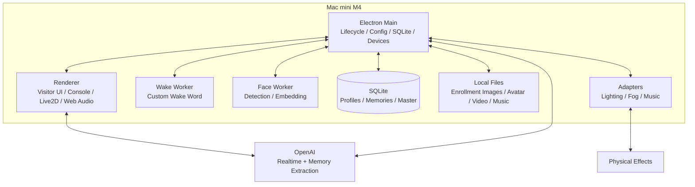
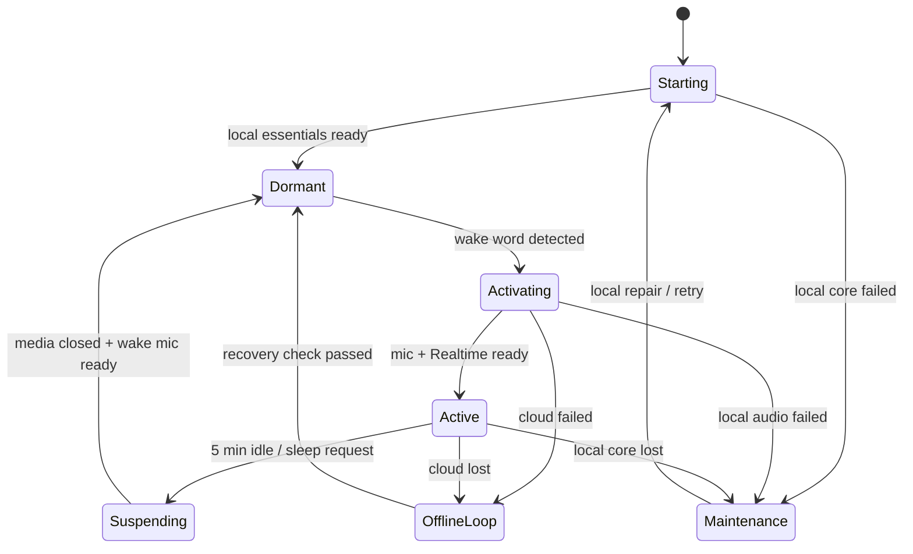

# 魔鏡 AI Avatar：Technical Specification

**版本：** 0.3.1  
**日期：** 2026-08-16  
**狀態：** Human-readable build baseline  
**產品範圍：** 單一私人招待所、單一 Mac mini、完整 Prototype  
**對應文件：** `Magic_Mirror_PRD_v0.3.md`、`Magic_Mirror_Stack_Adversarial_Review_2026-08-16.md`

> **v0.3.1（2026-08-16）修訂：** 依 stack adversarial review——sherpa-onnx pin ≥ 1.13.5（M4 靜默失效）；TCC 授權狀態進 Console 卡片；mic handoff 明確 `track.stop()`；playback completion 以 `output_audio_buffer.stopped` 為準；單一播放路徑實作註記；embedding 改 detector＋recognizer 成對版本；extractor baseline 改 `gpt-5.6-luna`；SQLite baseline 定為 `node:sqlite`；restart ownership 單一化；credential 改以 `safeStorage` 描述。
## 1. 這份文件要解決什麼

這份規格說明魔鏡軟體要如何組成、各部分如何合作，以及每一階段要怎麼獨立證明可用。

設計目標不是建立可販售的大型平台，而是在一個固定場域中做到：
- 喚醒、對話、Avatar、訪客辨識、記憶與空間特效像同一個角色。
- 正常時反應快；故障時不黑畫面、不永久轉圈，也不無聲失敗。
- 每個階段都可由本機 Developer Console 觀察、測試和排錯。
- 未來可以替換模型、Avatar、Voice 或硬體，但 Phase 1 不先實作多 Persona 平台。

本文件刻意不把 OpenAI SDK 的每一個事件名稱和設定欄位寫死。易隨版本變動的 payload，會在 Voice 階段依當日官方文件建立 contract test，再固定於程式碼和 lockfile。
## 2. 一般訪客會看到的完整體驗
### 2.1 正常流程

1. Mac 開機後自動啟動魔鏡，顯示沉睡中的 Avatar。
2. 本機 Wake Worker 持續聽自訂中文喚醒詞，此時不建立 OpenAI 連線。
3. 訪客說出喚醒詞後，畫面立即播放甦醒動畫。
4. 軟體把麥克風從 Wake Worker 交給 Realtime session，並同時短暫查看鏡前人臉。
5. 若相機提出一位可能的回訪者，魔鏡只問：「你是 Nova 嗎？」
6. 訪客口頭確認後，軟體在這條尚未含任何私人 history 的 session 載入該 Profile 記憶；不需要再連一次。
7. 若無法辨識、訪客否認，或不想建立 Profile，仍可匿名對話。
8. Avatar 以 OpenAI 內建 Voice 說話，嘴型由實際播放聲音驅動；訪客可隨時插話。
9. 完整說出設定咒語時，本機程式執行對應燈光、煙霧和音樂場景。
10. 對話期間，系統把適合保存的內容整理成近期摘要或長期事實，不保存完整逐字稿。
11. 最後一次有效互動結束五分鐘後，魔鏡淡出音樂、關閉雲端連線並重新進入沉睡。
### 2.2 多人與換人
- 鏡前同時有多人時，魔鏡詢問由誰作為本次主要訪客。
- 主要訪客口頭確認 Profile 後，可以讀取其記憶。
- 系統不宣稱能判斷多人中的每一句話由誰說。
- 指定 owner 後，本次內容都歸到該 owner；若選擇「大家一起」，則不讀寫任何個人記憶。
- 訪客說「換人」或「現在是 Alex」時，軟體關閉舊 Realtime session，以不含任何私人記憶的新 session 確認新 Profile，再於同一條乾淨 session 載入新 owner 記憶。
- 若 A 離開而 B 未口頭說明便直接接手，Phase 1 不保證能自動判斷；這是已接受的產品邊界。
### 2.3 雲端或網路不可用

雲端可用性不作為「能不能進入沉睡待命」的開機閘門。Wake Word 必須在離線時仍可工作。

發生以下任一狀況時，訪客畫面播放一段預先存於本機的固定特效影片並持續循環：
- 離線狀態下有人喚醒魔鏡，但 Realtime 連線在設定時間內無法建立。
- 對話中網路中斷或 OpenAI session 失效。

進入時固定依序停止AI audio與嘴型、淡出場景音樂、關閉Realtime session、清除active owner與RAM transcript，再開始影片；不在故障路徑等待Camera、Memory或telemetry完成。

本機核心音訊、SQLite、config或必要資產故障進Maintenance，不以OfflineLoop混淆故障來源。

循環影片的目的不是提供離線 AI，而是讓主持人一眼知道系統需要處理。影片播放期間：
- 不嘗試假裝正在對話。
- 不保存未完成的對話或記憶。
- Developer Console 仍可開啟。
- 系統只做輕量連線probe，採5→15→30→60秒上限的bounded backoff，不在背景反覆建立完整Realtime session。
- 服務恢復後停止影片並回到沉睡；訪客需要重新說喚醒詞，不續接先前半句。
## 3. 架構結論

Phase 1 採用一個 Electron modular monolith，也就是「一個應用程式、內部分模組」，而不是多個服務互相呼叫。

實作基線為 TypeScript＋Electron＋React（Electron pin 43.x）；XState v5 若採用，只管理七個 lifecycle states。SQLite baseline 為 Node 內建 `node:sqlite`（Electron ≥36 起可用、本案 pin 43.x；WAL 以 pragma 開啟、備份走 online backup API），必要時才退回單一 embedded binding。Wake Worker 使用 sherpa-onnx（**pin ≥ 1.13.5**：1.13.4 的 KWS 在 M4／SME Apple Silicon 上靜默偵測不到任何關鍵詞，k2-fsa/sherpa-onnx#3791）；Face Worker 使用 pin 版 Python／OpenCV YuNet＋SFace（detector 與 recognition model 成對 pin）。開始實作時依 2026-08 當日 stable release 鎖定精確 patch 和 lockfile，不在 PRD 寫死易變版本。

### 3.1 為什麼這樣做
- Mac mini 是唯一主控，沒有分散式協調需求。
- Electron 同時適合全螢幕 Avatar、本機管理介面、Web Audio 和官方 WebRTC SDK。
- Wake Word 與人臉模型使用不同 native runtime，獨立 worker 可避免拖慢畫面。
- SQLite 足以處理單場域的訪客 Profile 和記憶，不需要外部資料庫。
- 燈光、煙霧和音樂直接由同一程式的 adapter 控制，故障點最少。
### 3.2 各部分負責什麼
| 元件 | 主要責任 | 明確不負責 |
|---|---|---|
| Electron Main | 生命週期、設定、資料、Profile、場景和設備 | 不繪製 Avatar、不直接播放 Realtime 音訊 |
| Renderer | 訪客畫面、Console、Live2D、Web Audio、Realtime media | 不直接開 SQLite、不決定 Profile 權限 |
| Wake Worker | 沉睡時辨識自訂喚醒詞 | 不保存錄音、不建立 OpenAI session |
| Face Worker | 偵測人臉、計算 embedding、提出候選人 | 不自動確認身分、不讀取記憶 |
| SQLite | Profile、embedding metadata、記憶和 Master Memory | 不保存逐字稿、音訊或原始 runtime frame |
| Device adapters | 執行核准的燈光、煙霧和音樂 preset | 不接受模型任意指定硬體參數 |
| OpenAI Realtime | 語音理解、回覆、Voice、語音活動偵測與插話 | 不決定 Profile、記憶歸屬或咒語執行 |
## 4. 設計原則

1. **先讓體驗持續，再記錄降級：** 相機、記憶抽取或某個特效故障時，不應阻止其他功能工作。
2. **故障一定看得見：** 訪客看到合適的 fallback；管理者在 Console 看到原因和最近一次結果。
3. **不重做 OpenAI 已處理的事：** Realtime session 自己管理語音活動、回覆和插話；本機不複製一套對話狀態機。
4. **私人記憶只在口頭確認後載入：** 人臉辨識只是便利的候選提示，不是授權本身。
5. **Profile 切換就換 session：** 不在同一個 Realtime history 中把 A 的記憶替換成 B。
6. **AI 不控制硬體細節：** 咒語比對、場景 preset 和執行都由本機 deterministic code 決定。
7. **保留可替換點，不先做平台：** 模型、Avatar、embedding 和設備使用清楚 interface，但不做 plugin marketplace 或微服務。
8. **觀測功能從第一天存在：** Console 與本機 telemetry 是 Foundation，不是最後才補的維運功能。
## 5. 簡單生命週期

產品只有七個主要狀態。OfflineLoop 專指雲端／網路失效；Maintenance 專指本機核心資料、資產或裝置故障。Admin／Developer Console 是可從任何狀態打開的第二個本機視窗，不是另一套生命週期。

| 狀態 | 訪客畫面 | 麥克風 | OpenAI | 允許的主要行為 |
|---|---|---|---|---|
| Starting | 啟動畫面 | 關閉或測試中 | 關閉 | 載入本機設定、資料和資產 |
| Dormant | 沉睡 Avatar | Wake Worker | 關閉 | 聽喚醒詞、開 Console |
| Activating | 甦醒動畫 | 交接至 Renderer | 建立中 | 連線、短暫找候選 Profile |
| Active | 互動 Avatar | Renderer／WebRTC | 開啟 | 對話、辨識、記憶、場景 |
| Suspending | 睡眠動畫 | Renderer → Wake Worker | 關閉中 | 停止回覆、淡出音樂、清 RAM |
| OfflineLoop | 固定循環特效影片 | 視故障釋放 | 關閉／探測 | 顯示故障、開 Console、等待恢復 |
| Maintenance | 本機維護靜態畫面 | 關閉 | 關閉 | 顯示本機故障、開 Console、修復／重啟 |
### 5.1 狀態判斷的最小資料

Main 只需要保留：
- 目前 lifecycle state。
- 本次 activation ID。
- 目前 Realtime session ID。
- active Profile ID，或 anonymous。
- 最後一次有效互動時間。
- 目前 scene invocation ID（若有）。

不建立 identity epoch、write-policy epoch、平行 XState region 或跨程序通用事件序號系統。
### 5.2 過期事件處理

Renderer 每次建立 Realtime session 都取得新的本機 session ID。事件只要不是目前 session ID 就忽略，並在 Console 留一筆 `stale_session_event`。

這一個規則足以處理切換 Profile、重新連線和 Renderer restart，不需要為每個模組建立複雜的 ACK protocol。
## 6. Foundation：Admin／Developer Console 與本機 Telemetry

Console 是開發和現場排錯的主要工具，必須在第一個可執行版本就存在，之後每個 Phase 擴充。
### 6.1 存取方式
- 只在本機使用，不建立遠端後台或登入服務。
- 可由鍵盤快捷鍵和畫面隱藏熱區開啟。
- 在 Dormant、Active、OfflineLoop 或 Maintenance 都可開啟。
- 開啟 Console 時，可選擇是否暫停訪客互動；不得讓測試按鈕意外觸發正式場景。
- 離開 Console 回到符合當下健康狀態的 Dormant、OfflineLoop 或 Maintenance。
### 6.2 Foundation 必須顯示
| Status card | 顯示內容 | 可執行動作 |
|---|---|---|
| Application | app／build／config／asset／model版本、uptime、lifecycle、最後錯誤 | restart app、切換 visitor view |
| Network／OpenAI | 網路、最近 probe、Realtime 狀態 | test connection |
| Audio | input/output device、是否可開啟、TCC 麥克風授權狀態 | record short RAM sample、play test tone |
| Wake | worker、model、最後偵測 | start/stop、模擬 wake |
| Camera | device、frame availability、TCC 相機授權狀態 | preview、capture test |
| Avatar／Assets | Live2D、offline video、music manifest | play motion、play OfflineLoop |
| SQLite／Files | DB open、migration、storage path | integrity check、manual backup |
| Adapters | mock／physical、最近 health | test preset、stop all |
| Events／Phase Tests | 可篩選事件、當前Phase、最近測試build／時間／結果 | run smoke test、export metadata-only diagnostics |

尚未實作的模組顯示 `Not implemented`，故障顯示 `Degraded` 或 `Failed`，不可空白或永遠顯示 loading。
### 6.3 本機 telemetry

Main 維護最多 2,000 筆事件的 RAM ring buffer，並以非阻塞 writer 保存 rotating JSONL：單檔上限 5 MB、最多 5 檔。Writer queue 最多 1,000 筆；滿時丟最舊項並遞增 `telemetryDroppedCount`，寫入失敗也不得阻止 wake、Voice、Avatar 或 scene。Console 的 Events 採分頁讀取。Phase 1 不導入 Sentry、PostHog、Prometheus、OpenTelemetry server 或外部 log stack。

每筆事件只包含：
```text
time, module, event, status, duration_ms?, error_code?, session_id?, scene_id?, reason?, source?
```

允許記錄：
- lifecycle transition 和原因。
- Realtime connect／disconnect、延遲和用量。
- wake 偵測 metadata（keyword、設定 threshold／boost）、activation camera face count、candidate score。
- Avatar FPS、audio underrun、插話停止延遲。
- memory extraction success／skip／failure 數量。
- scene、adapter 和 cue 執行結果。
- worker crash、restart 和本機 recovery。
- Simulator 事件必須帶 `source=simulator`，不得與真實設備事件混在同一驗收結果。

不可記錄：
- 完整使用者或 Assistant 逐字稿。
- 音訊 buffer 或錄音。
- 注入模型的私人記憶內容或完整 prompt。
- enrollment image、runtime camera frame 或 embedding vector。
- API key、Realtime client secret。

Developer Console 可以在當次 session 暫時顯示 final transcript，供開發咒語和記憶抽取；關閉頁面或 session 後即清除，不寫入 telemetry 檔。
### 6.4 Console 隨 Phase 成長
| Phase | 新增 Console 能力 |
|---|---|
| Foundation | lifecycle、assets、local devices、OfflineLoop、event timeline |
| Voice | wake、Realtime、transcription、latency、barge-in test |
| Avatar | motion、expression、FPS、audio analyser、music gain |
| Identity | candidate、Profile、enrollment gallery、embedding version、rebuild |
| Memory | recent／durable facts、extract result、Master edit、manual correction |
| Scenes | spell test、timeline preview、adapter health、stop all |
| Hardening | backup／restore、diagnostic export、soak summary |
## 7. OpenAI Realtime 對話
### 7.1 Phase 1 選擇
- Model：`gpt-realtime-2.1`。
- Transport：WebRTC。
- SDK：官方 OpenAI Agents SDK 的 `RealtimeSession`／WebRTC transport wrapper。
- Voice：一個 OpenAI 內建 Voice，由現場中文 A/B test 決定。
- Persona：由 versioned system instructions 提供。
- Reasoning：`low` 作為低延遲起點，只有現場數據證明品質不足才調高。
- Input transcription：`gpt-live-transcribe` 作為 2026-08 baseline，取得 completed transcript供咒語與記憶；精確 config由live contract test固定。
- Local persistence：`historyStoreAudio: false`、`tracingDisabled: true`；Main process 另設 `OPENAI_AGENTS_DISABLE_TRACING=1`、`OPENAI_AGENTS_DONT_LOG_MODEL_DATA=1`、`OPENAI_AGENTS_DONT_LOG_TOOL_DATA=1`，production 不開啟 `DEBUG=openai-agents*`。精確 option 名稱仍由 pin 版 SDK contract test驗證。

Realtime model 負責自然中文、中英混用、Voice、語音活動偵測、回覆與插話。本機程式只取得它需要的少數訊號：
- session ready／closed／failed。
- user speech started。
- completed user transcript 與對應 item ID。
- remote audio stream。
- response interrupted／playback completed的必要狀態。

本機不另建 Listening／Thinking／Speaking 的權限狀態機。Avatar 顯示狀態可由 SDK event 和實際 audio analyser 推導。

Realtime可在completed transcript抵達前開始回答，Voice hot path不等待transcript。Transcript缺失時當次對話繼續，但identity confirmation不成立、scene不觸發、memory不保存，並記`transcript_unavailable`。
### 7.2 建立 session

1. Renderer 向 Main 要短效 Realtime credential。
2. Main 以 `safeStorage` 從 OS keystore（目標機為 macOS Keychain）讀正式 API credential並取得短效 credential。
3. Renderer 以 app-owned microphone stream 建立 `RealtimeSession`。
4. 連線完成後才把 lifecycle 從 Activating 改為 Active。
5. 斷線時立即停止 AI audio，關閉該 session ID 並進 OfflineLoop。

API key 不進 Renderer storage、設定檔或 log。
### 7.3 Context 組合

建立 session 時依下列順序組成 instructions：

1. 應用程式固定規則：Profile、記憶和硬體邊界。
2. Persona：角色背景、語氣、中文風格和回覆長度。
3. Master Memory：招待所共通知識。
4. 已口頭確認 Profile 的 durable facts。
5. 該 Profile 最近幾次 visit summaries。

Anonymous 或確認前的 session 不包含第 4、5 項。
### 7.4 Profile 切換

「Fresh session」是指關閉含有舊 owner history 的即時對話，再建立不含任何私人記憶的 clean confirmation session。Profile A→B 或 confirmed→anonymous／group 都先越過這條邊界，不在含 A history 的 session 直接改成 B。

Clean session 口頭確認 B 後，可用 Agents SDK `updateAgent(B)` 在**同一條 clean session**加入 B instructions、memory context與工具；因這條 history 從未包含 A，不需為 B 再建立第三條連線。初次喚醒的 candidate confirmation同樣使用clean session，確認後原地 `updateAgent`。這個行為必須由live contract test證明；若 pin版SDK不能可靠更新instructions／tools，才退回關閉clean session再建立B session。
### 7.5 長時間對話

應用程式依當日官方 Realtime session duration 上限設定提前重連時間。到達門檻後：
- 等目前 user turn 和 Assistant playback 結束。
- 顯示短暫鏡面過場。
- 關閉舊 session並以相同 Profile context 重建。
- 切換期間收到的新語音不暫存；Avatar 明確請訪客稍後重說。

這條路徑需測試，但不建立複雜 speech buffer。
### 7.6 Voice contract test

Voice Phase 開始時，Codex 必須用 pin 版 SDK 對真實帳號完成 contract test，確認：
- `gpt-realtime-2.1` 可透過 WebRTC 建立 session。
- 選定 built-in Voice 與 audio format 可用。
- 官方支援的 turn detection／barge-in 設定可用。
- completed input transcript 可由 item ID 對應本機 turn。
- interrupt、close、fresh reconnect，以及 clean confirmation session 的 `updateAgent` 行為符合需求。
- SDK 不在本機持久保存 audio history或額外 tracing content。
- Config 值確實到達 live session：SDK 對 transcription model（隱含預設 `gpt-4o-mini-transcribe`）與 turn detection 有自帶預設，測試必須斷言 session 實際使用 config 指定值，SDK default 不得成為 hidden fallback。
- `close()` 不會停止 app 自有的 microphone tracks；handoff 前明確 `track.stop()` 且確認 device 已釋放。
- Playback completion 以 WebRTC raw `output_audio_buffer.stopped` 事件為準（`audio_stopped` 只代表伺服器端生成完成）。
- Session 上限 60 分鐘且 SDK 無 reconnect API；rollover 必須以新 client secret＋新 session 重建。

通過後把精確 SDK version、config payload 和 raw-event mapping 固定於程式碼測試 fixture；不放在這份主文件中，以免文件隨 SDK 小改版失真。
## 8. 麥克風、播放與插話
### 8.1 單一麥克風擁有者

同一時間只能有一個元件開啟主麥克風：
```text
Dormant: Wake Worker
  → wake detected
  → Wake Worker closes stream
  → Renderer opens stream
Active: RealtimeSession
  → sleep / failure
  → Renderer closes stream
  → Wake Worker reopens stream
```

這是少數必須保留明確完成確認的地方，因為 macOS audio device 尚未釋放時立刻重開，會造成真正的 device-busy 故障。注意：Realtime SDK 的 `close()` 不會停止 app 提供的 mic tracks——Renderer 交還麥克風前必須自行對每個 track 呼叫 `stop()`，否則 Wake Worker 會遇到 device-busy 或 mic 指示燈不熄。

若交接失敗，這是本機音訊故障而不是雲端故障：進 Maintenance，Console 顯示 Audio Failed；Main 可嘗試一次重建 owner，仍失敗就等待人工處理。
### 8.2 Web Audio graph
```text
Realtime remote audio → audio element（唯一可聽輸出；AI ducking／mute 作用於其 volume）
                        └─ analyser tap（僅供嘴型與量測，不接 destination）
Local music           → music gain / ducking → output
```
- Realtime remote audio只接一條播放路徑：SDK 的 audio element 就是唯一可聽輸出，analyser 從同一 MediaStream 取樣（Chromium 的 `MediaStreamSource` 需要 stream 掛在 audio element 上才有輸出）；不得再經 Web Audio 額外輸出一次造成重複播放。
- Avatar 嘴型讀取 AI audio analyser，不使用字幕時間。
- 使用者開始說話時，依官方 Realtime interruption 能力停止 AI output；本機 AI gain 同時快速降為零。
- AI 或使用者說話時，音樂降低音量；空閒後平滑恢復。
- 進入 Suspending／OfflineLoop 時停止 AI audio，音樂在兩秒內淡出。
### 8.3 播放完成

Server 完成產生回覆不一定代表喇叭已播放完。需要等待實際 remote audio buffer 播放完，才可：
- 把 Avatar 從 Speaking 切回 Listening。
- 開始五分鐘 idle timer。
- 執行安全的 session reconnect。

實作以實際播放訊號為準：WebRTC 上為 raw `output_audio_buffer.stopped` 事件（SDK 的 `audio_stopped` 只代表伺服器生成完成，不代表喇叭播畢）；不足處才使用本機 audio analyser 判斷尾端靜音。這是 Renderer 內部細節，不建立全域手動 ACK 系統。
## 9. Avatar 與本機視覺資產
### 9.1 Live2D

Phase 1 使用一個 AI 生成、完成分層和 rig 的半寫實 Live2D 角色。

至少提供：
- Dormant 呼吸／微動。
- Waking 甦醒。
- Listening。
- Thinking。
- Speaking。
- Scene 表情和動作。
- Suspending。

Speaking 嘴型由實際播放聲音的音量與可用 phoneme／MotionSync 資訊驅動。字幕只供 debug，不作嘴型時鐘。
### 9.2 自然感最低要求
- 眨眼時間有小幅隨機性。
- 待機有呼吸和微頭動，但不持續大動作。
- 狀態切換使用短 transition，不瞬間跳 pose。
- 被插話時立即停止嘴型與尚未播放的 speaking motion。
- 角色正在聽時不維持誇張笑容或持續張嘴。
### 9.3 Offline asset

`service-unavailable-loop` 是本機影片資產，必須：
- 隨 app package 發布並在 Starting 時驗證可解碼。
- 不依賴網路、Live2D 或 OpenAI 才能播放。
- 無縫循環，畫面風格符合魔鏡世界觀。
- 可選擇搭配本機短音效，但不能不斷重播語音干擾現場。
- Developer Console 有獨立播放和停止按鈕。

若影片本身損壞，Visitor UI 改顯示內建 Maintenance still／shader 和診斷碼；不得黑畫面。
## 10. 訪客 Profile 與人臉辨識

人臉只回答「眼前可能是哪個 Profile」，不直接載入記憶；口頭確認「對，我是 Nova」才是 Phase 1 的授權。Identity 只保留 `unknown`、`pending_confirmation`、`confirmed`、`anonymous_or_group` 四種狀態。
### 10.1 回訪、新客與多人
| 情況 | 行為 |
|---|---|
| 單一清楚人臉且 top-1 達現場門檻 | Main 綁定 `pendingCandidateProfileId`，問「你是 X 嗎？」；明確肯定才 confirmed，否定就清除候選 |
| 無候選／模糊回答 | 詢問稱呼或匿名繼續；最多重問一次，不猜人 |
| 新訪客 | 口頭確認稱呼後以 UUID 建 Profile；正規化後的 `call_name` 在 Phase 1 必須唯一，衝突時請訪客選暱稱；可匿名或拒絕拍臉 |
| 多張主要臉 | 詢問誰是 active guest；仍須口頭確認，否則 anonymous group |

候選掃描只在 Activating 進行約 2～3 秒，排除過小、模糊或角度不佳的臉。`pendingCandidateProfileId` 只存在 Main；Renderer／模型只收到公開稱呼和確認句，任何 tool／model output都不能傳入或替換 `guestId`。

Main 在確認問題開始播放前先設定 `pending_confirmation`；其後**開始的下一個完整 user turn**就是yes／no回答，所以訪客可自然插話，不需要等問題播完。設定pending以前已開始的語音不算回答。若回答模糊或transcript unavailable，只重問一次；仍不清楚就清除候選並匿名／詢問稱呼，不猜人。這不需要challenge ID或playback gate。確認前session只有Persona＋Master，不含私人記憶；確認後Avatar明確說「今晚我會把這段相遇記在X名下」。

Owner 確認後不再看臉；其他人進出畫面不切換 owner、不暫停 personal writes，也不中斷回覆。只有選擇 anonymous group時不讀寫私人記憶。這是沉浸式單場域的簡化，不宣稱逐句辨認 speaker。
### 10.2 換人

收到明確「換人／我是 X」後：關閉目前含舊 owner history 的 session → 建立 Persona＋Master-only clean session → 由 Main 綁定並口頭確認候選 → 在同一 clean session `updateAgent`載入新Profile。失敗就匿名繼續或重新確認原Profile；不把切換前turns重新歸給新Profile。
### 10.3 Enrollment Images 與 Embeddings

取得口頭同意後保存 5～8 張最高品質 full-frame source images，連同 face bounding box、quality、consent／capture time、camera ID和SHA-256；aligned crop 是可重建的衍生資料，不作唯一來源。影像以 temporary file → close／fsync → atomic rename → DB row 的簡單順序寫入，失敗不留下破損 row。路徑使用 UUID：
```text
data/guests/<guest_uuid>/enrollment/<image_uuid>.jpg
```

只有 enrollment 保存影像；一般候選辨識 frame 只存在 RAM。Embedding metadata 記 guest／source image、**detector＋recognition model 成對**的 ID／version／檔案雜湊、normalization version、dimension、quality 和時間。detector（YuNet）變更會位移 `alignCrop` 的 landmarks 進而擾動 embedding，因此 detector 換版一律視為新 embedding 版本，不同 pair 的 vectors 不互相比較。

Console 的 `Rebuild embeddings` 從保存影像批次產生新版本，顯示失敗和簡單 same／different-person validation；整批達標才切換 active model，切換前保留舊版本供 rollback。不同模型的 vectors 不直接互相比較。
## 11. 記憶

產品不使用 L0／L1／L2／L3 術語，只需要四種資料：
| 資料 | 例子 | 保存位置 |
|---|---|---|
| 當次對話 | 剛剛談過的內容 | Realtime／RAM，休眠即清 |
| 近期來訪摘要 | 上次正在準備去加拿大旅行 | SQLite，保留最近數次 |
| 長期資料 | 喜歡烏龍茶、女兒叫什麼名字 | SQLite，直到被自然更正或 Admin 修改 |
| Master Memory | 招待所世界觀、房間故事 | SQLite，由 Admin 維護 |

不保存完整逐字稿或原始錄音。
### 11.1 自動抽取與歸屬

已確認 Profile 的 completed user transcript 可送到背景 extractor。它使用當日合適的 OpenAI text model＋Structured Outputs，產生 `ignore`、近期 note、新 durable fact 或自然 correction。Input 只有該 user turn、少量本次上下文和必要的同類既有資料；Assistant 的話不能成為 Guest fact。

抽取失敗時對話繼續、本回合不保存，Console 顯示 `memory_extraction_failed`；不得為補救而把逐字稿寫到磁碟。User speech開始時先快照owner，completed transcript到達後補上control分類，形成小型RAM context：
```ts
type MemoryTurnContext = {
  sessionId: string;
  turnId: string;
  guestIdAtTurnStart: string | null;
  memoryEligible: boolean;
  controlIntent: 'none' | 'identity' | 'confirmation' | 'sleep' | 'scene';
};
```

只有 `memoryEligible=true` 且 `controlIntent='none'` 才進 extractor。身分確認、報名字、換人、選擇 group、睡眠和咒語 turn都不抽個人記憶；因此「我是B，換人」不會在切換前被寫入A。
- Profile 未確認、anonymous 或 group mode：不建立 personal extraction job。
- Profile A 的工作即使在切換 B 後才完成，也只可寫入 A；實作也可在換人時直接取消尚未開始的 A jobs。
- DB 寫入前只需確認該 Profile 仍存在，不重新讀取目前 active Profile。

Pending extraction queue以單一consumer、最多16筆為基線；滿時丟最舊且尚未開始的項目，記 `memory_extraction_dropped`，不影響對話。

這能避免最重要的跨人寫錯，同時不需要 identity epoch 或多層 fence。
### 11.2 自然更正與管理

Phase 1 不提供「列出你記得什麼」、「忘掉這件事」或「忘掉我」等 guest-facing memory tools。

一般對話中的「我現在不喝紅酒了，改喝茶」仍可把同一 subject 的舊資料設為 superseded，再建立新資料。若不確定，保存為近期 note，不修改 durable fact。

管理者可在 Console 查看、修改、停用或刪除記憶。此操作是 POC 資料維護，不宣稱具有法規等級的不可復原刪除保證。
### 11.3 Context 與 Master

Confirmed session 載入少量有效 durable facts、最近 3～5 次 visit summaries，以及重要 open topics；依 recency、類型和 Admin importance 排序並限制 token。Phase 1 不使用 FTS5、向量資料庫、Supermemory 或額外 semantic recall service。

若單一 Profile 的資料日後大到超過 context budget，先由 Admin 整理或建立 compact profile summary；只有真實訪客發生「資料存在卻反覆找不到」後，才另開 Phase 2 retrieval research，不在 Phase 1 預建 gate。

Master 與 Persona 分開：Persona 決定怎麼說，Master 決定場域共同知道什麼。Admin 編輯 draft 後 Publish；以單一 SQLite transaction 或 atomic config replace發布，下一個 session 生效，失敗保留前版並顯示原因。

不需要 immutable revision bundle、digest hash或 active pointer state machine。普通備份即可回復舊版本。

### 11.4 為何 Phase 1 自建薄型 MemoryService

截至 2026-08，Mem0、Letta、Graphiti／Zep與Supermemory都能解決更大規模的 agent memory，但本案每位賓客預期只有少量結構化事實與近期來訪摘要。直接導入它們會同時增加 extraction規則、retrieval ranking、embedding／graph store、額外服務與另一個觀測面；這些都不是魔鏡自然對話的必要條件。
| 方案 | 適合的問題 | 本案 Phase 1 判斷 |
|---|---|---|
| Mem0 | 大量 memories 的自動抽取與 hybrid／entity retrieval | 2026 新版採 ADD-only 與 hybrid ranking；能力強，但本案還不需要 vector／entity store |
| Letta | 讓 agent 自主管理 always-in-context blocks與archival memory | 會與 Persona、Master及Realtime session ownership重疊，本案也不讓角色自由改自己的記憶工具 |
| Graphiti／Zep | 大型、會隨時間變動的實體關係與雙時間知識圖 | 需要 graph DB、embedding和額外 ingestion，對少量訪客偏好過重 |
| Supermemory | 託管式 profile、auto-capture與hybrid recall | 快速但增加另一個雲端依賴與內容傳輸，Console不再是唯一真相入口 |
| 本機 MemoryService＋SQLite | Profile isolation、近期摘要、可更正事實、Master context | **Phase 1 採用**；資料可直接看懂、改動和備份，查詢延遲最低 |

這個自建層不是通用 memory framework，只提供四個 application methods：
```ts
interface MemoryService {
  composeSessionContext(guestId: string | null): Promise<MemoryContext>;
  enqueueEligibleTurn(turn: MemoryTurnContext, text: string): void;
  listForAdmin(scope: { guestId?: string; master?: boolean }): Promise<MemoryItem[]>;
  applyAdminEdit(command: MemoryAdminCommand): Promise<void>;
}
```

Extractor baseline使用支援Structured Outputs的 `gpt-5.6-luna`（低價層足以勝任小 schema 抽取；`gpt-5.6-terra` 為 A/B 候選），輸出小型schema：`ignore`、`add_recent`、`upsert_durable`或`supersede_durable`。`subject_key`相同且為自然更正時，SQLite transaction把舊值標為superseded並新增新值；不確定的內容只放recent。Model名稱在config中可替換，Phase 6用contract test鎖定schema，不把它耦合進SQLite。

每次新session直接查 `WHERE guest_id = ? AND status = 'active'`，選重要stable facts與最近3～5次摘要；目前session的短期脈絡由Realtime history處理。Phase 1不做每回合semantic search。

只有在單一Profile累積數百筆active資料，或50個代表性recall案例低於90%時，才開ADR：先試SQLite FTS5，再比較embedding retrieval或上述framework。升級前 `MemoryService` interface不變，因此現在保留彈性不等於先運行一套用不到的平台。
## 12. 咒語與空間場景
### 12.1 觸發原則

只有 completed final transcript 經基本正規化後，整句等於設定咒語才觸發。

正規化可以處理：
- 前後空白。
- 一般標點。
- 全形／半形。
- 設定中明列的繁簡體等價字。

不採用 substring、embedding similarity 或 LLM 自由判斷，所以「不要說某咒語」和相似日常句不會誤觸發。

同一 transcript item只執行一次。這是一個簡單的 in-memory `processedTurnIds` set，不需要 distributed idempotency infrastructure。
### 12.2 Scene 定義

每個 Scene 包含：
- scene ID、名稱、完整咒語。
- cooldown。
- 一組依時間排列的 cues。
- 每個 cue 使用哪個 adapter、action 和 preset。
- scene timeout。
- 失敗時繼續其他 cues 或停止剩餘 cues。

LLM 看不到 DMX channel、煙霧秒數或任意檔案路徑。這些全部在核准 preset 中設定。
### 12.3 執行
```text
Final transcript
  → exact spell match
  → once-per-turn / cooldown check
  → local timeline
  → Lighting / Fog / Music adapters
  → result shown in Console
  → Avatar receives a short scene-result context
```

若 Realtime 已開始對該咒語產生一般回覆，使用官方 SDK 支援的 interrupt 能力停止該回覆。場景完成後，只要求一次符合實際結果的角色回覆。精確 SDK 呼叫方式由 Voice contract test固定，不建立自製 ITEM ACK／response serialization protocol。
### 12.4 Adapter
```ts
interface SceneAdapter {
  health(): Promise<{ status: 'ready' | 'degraded' | 'failed'; message?: string }>;
  execute(presetId: string, signal: AbortSignal): Promise<{
    status: 'success' | 'failed' | 'timeout';
    errorCode?: string;
  }>;
  stopAll(): Promise<void>;
}
```

Phase 1 只有三個 adapter 類別：Lighting、Fog、Music。每類有 mock 和一個實體 implementation。

某個 adapter 離線不阻止對話或其他 adapter工作。Scene result 和 Console 必須清楚顯示成功、部分失敗或 timeout，不可靜默略過。
## 13. SQLite、檔案與設定
### 13.1 概念資料表

Phase 1 需要：
- `guests`
- `enrollment_images`
- `face_embeddings`
- `visit_summaries`
- `guest_memories`
- `master_memory`
- `app_migrations`

正式 SQL schema 在 implementation appendix／migration files，不放在主文件中重複維護。
### 13.2 建議資料目錄
```text
Application Support/MagicMirror/
  config/
    active.json
    draft.json
    previous.json
  data/
    mirror.sqlite
    guests/<uuid>/enrollment/
  assets/
    avatar/
    music/
    offline/
  diagnostics/
    events-*.jsonl
  backups/
```
### 13.3 Config

`active.json`（連同 `draft.json`／`previous.json` 兩份姊妹檔）包含：
- Persona 與選定 Voice。
- idle duration。
- audio／camera stable device IDs。
- wake phrase和本機 model version。
- active face model pair（detector＋recognizer）。
- memory數量／context budget。
- spells、scene cues和adapter presets。
- Avatar、music、offline asset paths。

Config 編輯流程：draft → schema validation → 寫入暫存檔 → atomic replace。失敗顯示可理解的欄位錯誤並保留 `previous.json`，但不讓一個無關 scene 錯誤阻止 Anonymous Voice 功能啟動。
### 13.4 Credential
- OpenAI API credential 由 Electron `safeStorage` 寫入 OS keystore（目標機為 macOS Keychain；Windows 開發機為 DPAPI，同一 API）。不使用已封存的 keytar。
- Renderer 只取得短效 Realtime credential。
- Credential不進 config、backup、telemetry或 diagnostic export。
### 13.5 Backup／Restore

Backup 是單機資料可靠性功能，不是法規級資料清除系統。
- 備份 SQLite consistent snapshot、config、active model manifest 和 enrollment image directories。
- 每份備份建立manifest，列出上述檔案的相對路徑、大小與SHA-256；SQLite row保存的source image checksum也須相符。
- 預設每日一份，保留最近七份；也可由 Console 手動建立。
- Backup／Restore只能在Dormant或Maintenance且沒有active Realtime session時執行。
- Restore先解到staging directory，驗證manifest hashes、SQLite integrity、schema和所有enrollment image references，再切換整個data directory；失敗保留原資料，不留下半套DB／影像。
- Admin 刪除 live Profile 時移除 DB rows和 live enrollment directory；舊 backup 可能在 rotation 到期前仍包含舊資料，此為明列限制。

不建立 pre-delete backup purge、跨檔案 transaction journal或 guest-facing hard-delete workflow。
## 14. 故障行為
| 故障 | 訪客體驗 | Console／自動處理 |
|---|---|---|
| 網路／OpenAI 在 wake 前不可用 | 喚醒後播放 OfflineLoop | 顯示最近 probe；定期重試 |
| Active Realtime 斷線 | 停 AI audio，轉 OfflineLoop | 關閉 session ID；恢復後回 Dormant |
| Wake Worker crash | 顯示Maintenance，不能假裝仍可喚醒 | restart一次；仍失敗顯示Failed |
| Camera／Face Worker fail | 直接詢問名字或 anonymous 對話 | Identity card 顯示 Degraded |
| Face match不確定 | 不猜人，詢問稱呼 | 記 score和原因，不載入記憶 |
| Memory extractor fail | 對話正常，本回合可能不記得 | 顯示 failed count，可重測但不保存逐字稿 |
| SQLite／config無法讀取 | 顯示Maintenance，不開Voice或假裝可保存資料 | 顯示integrity／schema／open error |
| Live2D或OfflineLoop核心asset fail | 顯示內建Maintenance still／shader | Asset card指出缺少或decode error |
| Lighting／Fog fail | 其他cue和對話繼續 | scene標示partial failure |
| Music fail | 不播放音樂，對話繼續 | Music adapter顯示error |
| Renderer crash | Main 於 `render-process-gone` 重建 visitor window | 依health回Dormant、OfflineLoop或Maintenance |
| Main crash | LaunchAgent重啟整個app | 未完成RAM記憶可遺失 |

Restart ownership 單一化：launchd（LaunchAgent `KeepAlive={SuccessfulExit=false}`）是唯一的 app-level restart owner；Main 只在 `render-process-gone` 時重建 window。程式內不使用 `app.relaunch()`（兩套重啟機制會互相干擾）；連續失敗達上限時 `app.exit(1)` 交給 launchd。
### 14.1 不允許 Silent Failure

下列情況不得只在程式中 `return` 或 `drop` 而沒有紀錄：
- stale session event。
- transcript unavailable。
- memory extraction skipped／failed。
- face candidate被threshold排除。
- scene cooldown、timeout或adapter failure。
- config使用previous version。
- worker restart。

Console只記原因和metadata，不因此保存私人內容。
## 15. 效能與穩定性目標

效能報告使用指定 Mac mini、實際 audio device、正式 Avatar asset和場域網路。雲端延遲是現場量測目標，不是對 OpenAI 可用率的保證。
| 指標 | Phase 1 目標 |
|---|---:|
| Wake detected → Waking首幀 | P95 ≤ 150 ms |
| Wake detected → Realtime開始Listening | P95 ≤ 1.5 s，加註雲端樣本條件 |
| User turn結束 → AI audio開始 | P95 ≤ 2.5 s |
| User speech開始 → 可聽AI audio停止 | P95 ≤ 200 ms |
| AI audio開始 → mouth motion開始 | P95 ≤ 80 ms |
| Final spell transcript → first adapter dispatch | P95 ≤ 100 ms |
| Avatar render | 目標60 FPS；長測P95 ≥55 FPS |
| 10分鐘正常對話audio underrun | 0 |

最終可靠性驗收保留：
- 100次 wake → talk → interrupt → scene → sleep生命週期。
- 一次72小時定義 workload長測。
- Renderer／Main／worker各一次實際process kill recovery。

這些是最終 Hardening 驗收，不要求每個小改動都重跑72小時。
## 16. Progressive Implementation Plan

每個 Phase 都必須有一個不依賴下一階段的展示和驗收方式。正式 Exit Criteria 以 `Magic_Mirror_Implementation_Plan_v0.3.md` 為準；本表為摘要，數字若有出入以 Implementation Plan 為權威。
| Phase | 要完成的垂直切片 | 可獨立驗證的完成條件 |
|---|---|---|
| 0 Foundation／Console | Electron kiosk、自啟、簡單 lifecycle、Dormant stub、OfflineLoop、Console、local telemetry、config／Keychain／SQLite skeleton，以及全部 mocks | 10次開機不黑畫面；模擬雲端失敗→OfflineLoop，本機核心失敗→Maintenance；Console可從每個狀態打開；未完成模組顯示`Not implemented` |
| 1 Realtime Voice | Console手動啟動官方`RealtimeSession`／WebRTC、built-in Voice、中文Persona、completed transcript、barge-in、cloud-loss與OpenAI contract test | 20回合中文／中英對話和10次插話；wake尚未實作也可demo；connect／active failure都進OfflineLoop |
| 2 Wake Lifecycle | sherpa custom wake、mic handoff、五分鐘idle、口頭sleep、離線時仍可wake | 20次wake→talk→sleep；離線wake進OfflineLoop；Wake與Realtime不會同時持有mic |
| 3 Avatar／Audio | 正式Live2D、remote audio嘴型、idle motion、expression transition、music graph／ducking | 10分鐘Voice＋Avatar＋music無雙重播放或underrun；插話停止嘴型（「5人中至少4人認為不突兀」改列 Phase 7 現場檢查） |
| 4 Scenes | Exact spell、cooldown、timeline、三類mock／physical adapters、scene result、Console Scene panel | 每個spell 20正例／30負例且誤觸0；拔除設備只造成可見partial failure |
| 5 Identity／Profiles | Profile／image／embedding schema、face candidate、Main-bound口頭確認、匿名／認錯／多人／換人、clean session、gallery和rebuild | 兩位以上真人完成註冊與回訪流程；B session無A history；更換embedding model不需重拍 |
| 6 Memory | Recent summary、durable fact、Master、structured extractor、TurnContext、context composer、Admin editor | 30～50組中文案例；A／B交叉洩漏0；extractor失敗不影響Voice |
| 7 Field Hardening | 最終硬體／資產、完整Setup／Admin、backup／restore、diagnostic export、process recovery | 全部PRD Must stories、100 lifecycle、72小時soak；無人工重啟或無限queue／memory成長 |
## 17. 測試策略
### 17.1 每個模組的基本測試
- Lifecycle合法transition與OfflineLoop recovery。
- Config validation、previous-version fallback和secret redaction。
- Mic handoff和device-busy recovery。
- Realtime fresh session後history隔離。
- Completed transcript與本機turn對應。
- Identity Main-bound candidate、問題開始前／開始後回答、barge-in、positive／negative／ambiguous和unique call-name flow；模型傳guest ID必須被拒絕。
- Enrollment image寫入、缺檔、re-embedding和version rollback。
- Backup manifest hash、missing image與staging restore failure都保留原data directory。
- Memory extractor structured schema、natural correction、guest ownership，以及identity／confirmation／switch turns不進extractor。
- Exact spell、negative sentence、duplicate turn、cooldown和adapter timeout。
- Console每種failure都有visible event。
- Telemetry queue滿載／disk write failure不阻塞visitor hot path，且`telemetryDroppedCount`增加。
### 17.2 端到端場景

1. Cold boot → Dormant → anonymous Voice → sleep。
2. Offline cold boot → wake → OfflineLoop → network recovery → fresh wake。
3. New guest → name → enrollment images → talk → sleep。
4. Return guest → candidate → verbal yes → correct memory context。
5. Wrong candidate → no → anonymous／self-identify，沒有private memory。
6. Confirm A → explicit switch → clean confirmation session → same-session `updateAgent(B)`；B看不到A history。
7. Multiple faces → choose owner／anonymous group；owner確認後其他人進出不切換、不停寫，只有anonymous group不寫。
8. Talk → barge-in → exact spell → physical scene result。
9. Music → conversation ducking → stop → idle sleep。
10. Realtime loss → OfflineLoop → Console diagnosis → recovery。
11. Rebuild all embeddings from saved images → activate new version → rollback old version。
12. Backup → modify data → restore → DB與images一致。
### 17.3 測試資料原則
- CI使用人工合成姓名、逐字稿和licensed／synthetic face images。
- 真實enrollment images只留在場域Mac和其本機backup。
- Production telemetry不因測試需求而開啟內容保存。
- Performance test保留日期、SDK／model version、硬體和網路條件。
## 18. Architecture Decisions

Phase 1需要記錄的不可隨意變更決策只有：

1. Electron modular monolith，不採微服務。
2. 官方Agents SDK RealtimeSession＋WebRTC，不自建speech-to-speech transport。
3. 一個簡單lifecycle owner；不複製Realtime內部對話狀態。
4. Wake與Realtime不能同時持有麥克風。
5. Profile需口頭確認；人臉只提候選。
6. Profile scope變更先建立不含舊owner history的clean confirmation session；確認後可在該clean session更新Agent。
7. 保存consented enrollment images，embedding按model version重建。
8. SQLite保存recent／durable／Master Memory，不保存逐字稿。
9. 完整咒語由本機exact matcher決定；硬體只跑核准preset。
10. Console／local telemetry從Foundation存在，不採外部observability stack。
11. 雲端不可用時播放本機OfflineLoop，不提供offline AI。

其他易變細節放implementation appendix或code contract test，不增加主文件認知負擔。
## 19. Phase 1 明確不做
- 多場域、多租戶或remote admin。
- Home Assistant、MQTT、MCP、LangGraph、Temporal、Redis或微服務平台。
- Supermemory、Mem0、向量資料庫或graph memory。
- Speaker diarization或voiceprint authorization。
- 持續1:1人臉監控、biometric continuity gate或自動辨認每一句speaker。
- Guest-facing記憶列表、remember／forget／forget-me工具。
- 法規級不可復原資料刪除和pre-delete backup purge。
- 完整逐字稿、原始錄音或conversation replay UI。
- 多Persona、多Avatar、custom Voice或Persona marketplace。
- 任意Scene visual programming language。
- Offline LLM／TTS／STT fallback。
## 20. 實作前仍需場域輸入

不阻塞Foundation／mock開工，但會阻塞對應Phase現場驗收：
| 輸入 | 最晚需要時間 |
|---|---|
| Persona Bible與三個built-in Voice候選 | Voice Phase |
| 自訂wake phrase與可接受發音 | Wake Phase |
| Live2D分層素材、rig和motion map | Avatar Phase |
| Camera實際安裝角度和enrollment consent wording | Identity Phase |
| Memory保留數量、可主動提起的語氣 | Memory Phase |
| 三組完整咒語、scene timeline和cooldown | Scene Phase |
| Lighting／Fog控制介面、music assets | Physical Scene Phase |
| OfflineLoop video final asset | Foundation field acceptance |

缺少final內容時Codex使用清楚標示的mock／placeholder，不自行把placeholder當成正式決策。
## 21. 主要依據（截至 2026-08）
- [OpenAI GPT-Realtime-2.1](https://developers.openai.com/api/docs/models/gpt-realtime-2.1)
- [OpenAI Realtime WebRTC](https://developers.openai.com/api/docs/guides/realtime-webrtc)
- [OpenAI Agents SDK — Building Realtime Agents](https://openai.github.io/openai-agents-js/guides/voice-agents/build/)
- [OpenAI Agents SDK — Realtime transport](https://openai.github.io/openai-agents-js/guides/voice-agents/transport/)
- [OpenAI Realtime conversations](https://developers.openai.com/api/docs/guides/realtime-conversations)
- [OpenAI Realtime transcription](https://developers.openai.com/api/docs/guides/realtime-transcription)
- [OpenAI GPT Live Transcribe](https://developers.openai.com/api/docs/models/gpt-live-transcribe)
- [OpenAI GPT-5.6 Terra](https://developers.openai.com/api/docs/models/gpt-5.6-terra)
- [OpenAI Structured Outputs](https://developers.openai.com/api/docs/guides/structured-outputs)
- [XState v5](https://stately.ai/docs/xstate)
- [Live2D MotionSync](https://docs.live2d.com/en/cubism-editor-manual/motion-sync/)
- [sherpa-onnx custom keyword spotting](https://k2-fsa.github.io/sherpa/onnx/kws/pretrained_models/index.html)
- [OpenCV YuNet](https://github.com/opencv/opencv_zoo/tree/main/models/face_detection_yunet)
- [OpenCV SFace](https://huggingface.co/opencv/face_recognition_sface)
- [SQLite](https://www.sqlite.org/docs.html)
- [Mem0 memory architecture](https://docs.mem0.ai/platform/features/graph-memory)
- [Letta memory blocks](https://docs.letta.com/guides/core-concepts/memory/memory-blocks)
- [Graphiti](https://github.com/getzep/graphiti)
- [Supermemory](https://github.com/supermemoryai/supermemory)

所有OpenAI model ID、SDK option和event payload都須在對應Phase開始時以官方文件與真實contract test再次確認；本文件的日期不是未來版本相容性保證。
