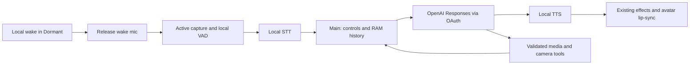

# Magic Mirror: Apple Silicon voice stack survey — 2026-10-04

Follow-up: [personal ChatGPT persona migration and avatar memory](persona-memory-migration-survey-2026-10-04.md), including the distinction between OAuth model access and access to ChatGPT memories.

Recommendation: prototype a second conversation backend using the existing sherpa-onnx wake detector, local Qwen3-ASR, OpenAI Responses through official Sign in with ChatGPT, and local Qwen3-TTS. Keep the working Realtime backend available until a comparison on this Mac establishes acceptable voice quality, latency, interruption and reliability.

This is a research recommendation, not an implemented migration or a measured performance win. “Verified” below means confirmed in repository code, local hardware metadata, or a linked primary source. “Proposed” means engineering judgment. “Unverified” means it still requires account access or a local experiment. The requested final speech stage is interpreted as TTS.

Verified locally: `sysctl -n machdep.cpu.brand_string hw.memsize` returned Apple M6 and 34359738368 bytes (32 GiB); `sw_vers` returned macOS 27.0.1, build 26A434. Both commands exited 0. No microphone capture, model installation, account sign-in, benchmark, or application restart was performed for this survey.

## Recommended stack

| Layer | Proposed selection | Reason and evidence |
| --- | --- | --- |
| Application | Existing Electron/TypeScript Main and renderer | Preserve Console, avatar, camera, media, lifecycle, tool catalog and memory boundaries. |
| Dormant wake | Existing pinned sherpa-onnx keyword package, current 0.32 default | Already operator-confirmed for loop interruption. Upstream supports offline keyword spotting on macOS arm64. Preserve the working package and pronunciation. [Verified capabilities](https://github.com/k2-fsa/sherpa-onnx). |
| Active speech boundaries | Silero VAD through ONNX; bounded RAM audio buffer | Lightweight local speech detection. It detects speech, not whether a sentence is semantically complete; the app must supply endpoint timing. [Verified upstream](https://github.com/snakers4/silero-vad). |
| STT | Qwen3-ASR-1.7B, MLX 8-bit; compare 0.6B | First quality candidate for Mandarin and English mixed usage. The original family covers Chinese dialects; both sizes have MLX conversions. [Verified model](https://github.com/QwenLM/Qwen3-ASR), [verified MLX implementation](https://github.com/Blaizzy/mlx-audio/blob/main/mlx_audio/stt/models/qwen3_asr/README.md). Actual Taiwan Mandarin accuracy is unverified. |
| Cloud reasoning | Responses streaming; GPT-6.1 Sol at low reasoning as quality baseline | Compare GPT-6 Luna at none/low for response speed and cost. Select only a model available to the account and pin the selected ID in versioned configuration. This is a proposed comparison, not a claim that one wins Raven roleplay. [Verified Sol capabilities](https://developers.openai.com/api/docs/models/gpt-6.1-sol), [Luna capabilities](https://developers.openai.com/api/docs/models/gpt-6-luna). |
| Authentication | Official Sign in with ChatGPT, owned by Electron Main | Current documentation supports eligible Responses usage from local apps. Account eligibility and a successful tool-bearing inference request remain unverified. [Verified route](https://developers.openai.com/siwc/token-sharing-open-source). |
| TTS | Qwen3-TTS-12Hz-1.7B-CustomVoice through MLX Audio | Start with a stable preset and style control; compare 0.6B for latency. Base is the voice-cloning variant; VoiceDesign creates voices from descriptions. These variants are not interchangeable. [Verified MLX support](https://blaizzy.github.io/mlx-audio/models/tts/qwen3-tts/). |
| Output | PCM chunks → existing Web Audio effects, speaker output and lip-sync | Preserve Raven effects and output device selection. Completion means the audible queue and effect tail have finished. |

Use one persistent, Main-supervised MLX helper with preloaded STT and TTS for the initial prototype. Exchange RAM buffers through private IPC; the helper does not independently open the microphone. Use native arm64 Python and MLX, with pinned package/model revisions and hashes. Do not spawn a Python process per sentence or adopt a demo server that saves WAV files, transcripts or generation history. This is the proposed smallest integration for the current Electron app, not a requirement to rewrite it in Swift.

The reviewed MLX Qwen ASR examples stream text tokens from supplied audio. That does not by itself prove continuous incremental microphone decoding. Start with VAD-delimited utterances and measure finalization delay; evaluate rolling/partial recognition only if that delay is unacceptable. Likewise, streaming TTS output does not guarantee arbitrary token-by-token text input. Feed short, stable phrases into the documented synthesis interface. [ASR interface](https://github.com/Blaizzy/mlx-audio/blob/main/mlx_audio/stt/models/qwen3_asr/README.md).

32 GiB makes this a credible candidate, but model weights alone do not establish peak RAM usage. MLX inference, Live2D, camera and video compete for system resources. Measure the complete workload and retain headroom; no M6 speed or memory result is claimed here.

## OAuth: feasible, with a different contract

Verified: OpenAI now documents direct ChatGPT-plan inference for open-source and locally hosted apps, including dynamic registration. The app uses its own registration and a stable host identifier; it does not borrow the coding agent's login files. Registration uses PKCE, state and nonce, then stores the issued client identity. [Overview](https://developers.openai.com/siwc/token-sharing-open-source), [registration](https://developers.openai.com/siwc/token-sharing-open-source/sign-in).

Verified: send the access token to the public `/v1/responses` endpoint. The account-specific model list informs selection, but completed inference proves access. HTTP requests require `store:false`, `stream:true`, and caller-supplied context. [Models and inference](https://developers.openai.com/siwc/token-sharing-open-source/models-and-inference).

Verified preview limitations: no audio/video input or transcription API on this route. Images are accepted when supported by the selected model, so camera capture can still supply a still image. Instructions/developer messages replace explicit system-role input items. HTTP history cannot use `previous_response_id`; unsupported options include `temperature`, `max_output_tokens` and `background`. Function/custom tools require the documented namespace or additional-tools representation. Hosted MCP and several other hosted tools are unsupported. [Exact current contract](https://developers.openai.com/siwc/token-sharing-open-source/preview-limitations).

Proposed: use direct Responses from Main. [Codex app-server is documented](https://developers.openai.com/siwc/token-sharing-open-source/codex-app-server), but adds a coding-agent runtime, tool surface and history lifecycle that this avatar does not need. Keep media/camera functions in the existing application catalog and validate calls in Main. The OAuth wire representation needs an adapter, not an independent copy of the tool definitions.

Verified: tokens require protected storage and serialized refresh; sign-out includes revocation. Plus usage is shared across apps in a five-hour allowance; that particular limit does not apply to Pro. Per-app limits can still cause errors. Do not describe this as unlimited or free compute. [Accounts and sessions](https://developers.openai.com/siwc/token-sharing-open-source/profiles-and-sessions), [errors](https://developers.openai.com/siwc/token-sharing-open-source/errors-and-recovery).

Current project invariant 12 permits only the ignored root `.env` master API key loaded by Main. Implementing OAuth therefore needs an explicit revision of that credential design, including token storage and sign-out. The survey changes neither the invariant nor credentials. Operator cloud authentication must also remain separate from visitor identity and private-memory confirmation.

Local speech keeps raw conversation audio off the cloud reasoning path. Transcribed text, selected context and explicitly requested camera images still leave the Mac. `store:false` does not establish zero provider retention or identical data-use rules between ChatGPT-plan and API billing; those account-specific terms remain to be verified before migration.

For comparison, current standard API text prices are $2 input / $10 output per million tokens for Sol, and $0.10 / $0.50 for Luna. These are API-billing prices, not OAuth plan charges. Local STT/TTS removes cloud audio metering, but total savings depend on conversation length, retained context, reasoning usage and the existing voice bill. [Sol pricing](https://developers.openai.com/api/docs/models/gpt-6.1-sol), [Luna pricing](https://developers.openai.com/api/docs/models/gpt-6-luna).

## Alternatives worth considering

| Candidate | Verified facts | Assessment for this project |
| --- | --- | --- |
| WhisperKit + multilingual Whisper large-v3 turbo | Swift/Core ML implementation with live microphone support and explicit model selection. [Upstream](https://github.com/argmaxinc/argmax-oss-swift) | Strongest STT comparison candidate. Native integration may reduce MLX GPU contention, but the actual compute placement and end-to-end advantage need measurement. Avoid English-only models. |
| whisper.cpp | C/C++, Metal, Core ML and Apple Silicon support. [Upstream](https://github.com/ggml-org/whisper.cpp) | Good portable native deployment option; not necessary to add alongside both MLX and WhisperKit in the first trial. |
| Apple SpeechAnalyzer / SpeechTranscriber | On-device speech recognition; supported and installed locales are queried at runtime. [Apple session](https://developer.apple.com/videos/play/wwdc2025/277/), [API](https://developer.apple.com/documentation/speech/speechtranscriber) | Useful native baseline. Verify the actual Chinese locale and mixed-language behavior; OS availability alone does not prove either. |
| SenseVoiceSmall / Fun-ASR-Nano | Chinese-capable alternatives; SenseVoice also emits emotion/event information. [SenseVoice](https://github.com/QwenAudio/SenseVoice), [FunASR](https://github.com/modelscope/FunASR) | Secondary STT choices if Qwen/WhisperKit fail room-noise or latency targets. Model licenses are distinct from runtime licenses. |
| Parakeet TDT v3 | The reviewed MLX catalog lists 25 European languages. [Catalog](https://blaizzy.github.io/mlx-audio/models/stt/) | Not the primary Mandarin recognizer. English benchmark speed is insufficient for Raven. |
| Kokoro 82M | Small Apache-licensed TTS model; MLX supports Mandarin presets. [Model](https://huggingface.co/hexgrad/Kokoro-82M), [MLX catalog](https://blaizzy.github.io/mlx-audio/models/tts/) | Good speed baseline; less suitable when custom character voice and expressive delivery are priorities. |
| Breeze TTS 2 | Chinese/English voice design, cloning and direction; released August 2026. MLX conversions and streaming exist. Weights and self-hosted outputs have noncommercial restrictions. [Publisher](https://huggingface.co/BreezeBlue/Breeze-TTS-2), [MLX port](https://blaizzy.github.io/mlx-audio/models/tts/breeze-tts/) | Best newer expressive challenger to audition for this personal project. Published H100 latency is not a Mac result. |
| Fish Audio S2 Pro | Multilingual synthesis and fine-grained emotion/prosody control under its research license. [Publisher](https://github.com/fishaudio/fish-speech) | Worth a later quality audition; the reviewed publisher page does not establish an accepted M6 deployment. |

Verified licensing facts: Qwen3-ASR and the reviewed Qwen3-TTS CustomVoice weights are Apache-2.0; sherpa-onnx is Apache-2.0 and Silero is MIT. Converted weights, phonemizers and other bundled components still need their own notices. [ASR model card](https://huggingface.co/Qwen/Qwen3-ASR-0.6B), [TTS model card](https://huggingface.co/Qwen/Qwen3-TTS-12Hz-1.7B-CustomVoice).

A newer paper is not automatically a deployable replacement. The September Qwen-Audio-3.0-ASR report describes a streaming variant, but this survey did not establish downloadable weights plus a supported MLX runtime for it. Treat local availability as unverified. [Primary report](https://arxiv.org/abs/2609.07549).

## Fit with Magic Mirror

Verified code boundaries from the read-only repository survey:

| Existing boundary | Migration implication |
| --- | --- |
| [Main lifecycle and session start](../src/main/boot.ts) | Currently depends on Realtime credentials, session IDs and start/stop outcomes. Introduce an explicit conversation-backend choice; changing only a model ID is insufficient. |
| [Microphone owner](../src/renderer/realtime/mic-owner.ts) | Currently couples release to a `RealtimeSessionHandle` and explicitly stops tracks. Adapt this boundary to the local conversation backend while retaining release acknowledgement. |
| [Session adapter](../src/renderer/realtime/realtime-session-adapter.ts) and [shared tool catalog](../src/shared/realtime-tools.ts) | Realtime SDK events and bindings need a Responses adapter. Reuse the application definitions and authorization rules. |
| [Processed output](../src/renderer/realtime/processed-audio-output.ts) and [lip-sync driver](../src/renderer/avatar/audio/lip-sync-driver.ts) | Feed local PCM into the output pipeline and preserve actual-playback signals; do not create an unrelated speaker path. |
| [Wake activation](../src/main/wake/conversation-activation.ts) | Existing `beforeStart` hook permits media cleanup before starting a conversation. Keep that order for either backend. |

Identity and extraction rules are required project contracts, not a claim that every integration is already present: the bounded survey did not establish the complete extraction writer or live identity-confirmation path. A migration must verify those callers before wiring new transcript events to them.

Make recovery probes and session rollover conditional on the backend. A local-speech/Responses session must not require a Realtime client-secret probe or inherit a Realtime session-duration timer. Preserve the existing LaunchAgent as the sole Electron restart owner; Main supervises only its speech helper.

Proposed flow:

Preserve existing black Dormant presentation, mist entrance, shared/per-avatar media discovery, loop silence and local wake interruption. Loop playback still cancels conversation output, releases the active microphone, and returns ownership to wake. Wake stops playback before starting the next conversation. Once-play completion restores the correct avatar/BGM state.

The main engineering work is turn ownership, not model loading. A local VAD must not confuse Raven or video audio with a visitor. Retain the existing capture/echo-cancellation path initially, then physically test it with the actual speaker/microphone routing. VAD is not echo cancellation. A successful clean-file STT benchmark says little about full-duplex room behavior.

Create one cancellation/generation identity across STT, cloud response, tools and TTS. On interruption, cancel the cloud stream, discard queued speech and reject late events. Maintain the distinction between generated text and speech actually heard; do not leave unsaid response tails in conversational history. Chunk speech at short phrase boundaries with limited lookahead so that first audio arrives early without destroying prosody.

Keep exact spell matching in the application on finalized recognition. Partial transcripts may drive UI but must not authorize hardware actions. STT corrections for display should not silently rewrite control authorization. Preserve clean profile-confirmation sessions, turn-start memory ownership and control-turn extraction exclusions. Audio and transcripts remain RAM-only, with metadata-only diagnostics.

A text intermediary loses vocal cues available to speech-to-speech models. Local TTS style controls can supply Raven's delivery, but they do not automatically recover the visitor's tone or Realtime's conversational timing. “More local” is not automatically “more natural.”

Existing effects settings are reusable, but a provider voice ID does not map automatically to a local voice. Raven's replacement voice needs an audition; matching the present voice is not established by selecting a similarly described preset.

## Small prototype and decision criteria

Proposed first trial: Qwen3-ASR 1.7B versus 0.6B and WhisperKit; Qwen3-TTS 1.7B versus 0.6B, with Breeze as one quality challenger. Keep all other behavior fixed. Start with presets; do not retrain models or clone voices to establish basic feasibility.

Measure cold startup separately from warmed interaction. Record only aggregate character error rate, command success counts, false wakes per hour, missed wakes, end-of-speech-to-first-audible-reply p50/p95, interruption delay, TTS real-time factor, peak memory, and dropped avatar/video frames. Use approved inputs and keep live content in RAM.

Suggested acceptance targets, not observed results: ordinary warm replies begin within 2 seconds at p50 and 4 seconds at p95; speech stops within 250 ms after accepted interruption; sustained TTS real-time factor stays below 1, ideally below 0.7 for headroom. Also require no self-conversation, no unexpected control activation, no stale speech after loop start, and reliable wake interruption at the actual media volume.

Test Mandarin, English names embedded in Mandarin, Traditional Chinese output, soft speech, pauses, background music, USB device recovery, OAuth expiry/quota failure, network loss, profile changes and camera/tool requests. Compare against the current Realtime experience on the same setup. Account access, local inference performance and subjective Raven voice quality are still unverified.

Console proposal: a single conversation-mode choice, a ChatGPT connection/status control, and the selected available cloud model. Put local-model tuning under Advanced. Each avatar gets a voice selector, short style setting and audible preview; retain the shared audio-output controls. Show actionable errors such as sign-in required or local speech unavailable, with detailed metadata confined to diagnostics.

The proposed outcome is an optional local-speech backend that earns promotion through this comparison. This survey does not change runtime model IDs, deployment, credentials, dependencies or phase acceptance.
