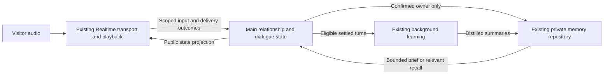

# Conversation quality: implementation-grounded research and proposed architecture

Recorded 2026-10-05. **Research and design proposal; no runtime changes or new live acceptance in this task.** Magic Mirror baseline: `aa4d01264ac4c6ea0eef8b74bb03316df844f64e`. Source line references below describe that revision. The installed Realtime SDK inspected was `@openai/agents-realtime` 0.16.1.

Subsequently implemented under the user's next instruction: [implementation and live-test report](testing/conversation-quality-implementation-2026-10-05.md). That report owns current delivery and the remaining live acceptance failure; this survey remains the original baseline/design record.

Recommendation: retain the existing Realtime voice path and scoped memory store. Add a small Main-owned dialogue protocol for identity and memory policy, synchronize its public state into Realtime, and simplify the conversational instructions. Repair these concrete gaps before considering a different voice framework or STT/TTS stack. This is an engineering recommendation from the evidence below, not a measured comparison of competing systems.

## Evidence boundary

- **Observed:** the [two real audio visits](testing/relationship-memory-real-conversation-2026-10-05.md) learned seven summaries and correctly recalled the material decision and commitment in a fresh session. They also produced repeated confirmation, an incorrect memory-policy explanation, approximately 51 words per visitor turn, and an unsupported claim about completed testing.
- **Verified in source:** the local paths and pinned open-source implementations cited below were inspected directly, including relevant upstream tests. Third-party code was not installed or executed. An upstream test's existence is evidence of its intended contract, not evidence that we ran it or that our app satisfies it.
- **Proposed:** the state protocol, wording examples, acceptance thresholds and implementation slices below have not been implemented or evaluated with users.
- Existing results do not establish natural room-microphone timing, human preference, large-archive retrieval quality, or historical-date accuracy in a large imported Markdown file. Synthetic audio traversed production WebRTC/API paths, but was not a human microphone trial.

## Research retained from the earlier survey

| Principle and primary source | Application to Raven | Limit |
| --- | --- | --- |
| Specify concrete response shape, explicit conversational stages and tool speech rules. [OpenAI voice prompting](https://developers.openai.com/api/docs/guides/voice-prompting). | Give the model a short response contract with examples; omit routine preambles for quick memory operations. | Prompt guidance does not guarantee compliance. The existing short-sentence rule already failed this fixture. |
| Establish common ground through the actual exchange. [Clark and Brennan, 1991](https://web.stanford.edu/~clark/1990s/Clark%2C%20H.H.%20_%20Brennan%2C%20S.E.%20_Grounding%20in%20communication_%201991.pdf). | A “yes” must answer the intended identity question; a successful tool call alone does not establish shared understanding. | Conversational theory supplies a design principle, not an authentication mechanism. |
| Use confirmation according to ambiguity and consequence; permit correction. [Google confirmation design](https://developers.google.com/assistant/conversation-design/confirmations). | Make the identity question explicit and single-purpose; do not ask it again after successful confirmation. | Older design guidance; not a recommendation to adopt that product stack. |
| Human turn transitions depend on prediction and context. [Levinson and Torreira, 2015](https://www.frontiersin.org/journals/psychology/articles/10.3389/fpsyg.2015.00731/full). | Measure pause handling, interruption and perceived timing as well as answer text. | Human timing observations are not a justified latency SLO for this app. |
| Semantic VAD uses estimated turn completion; eagerness changes when it yields. [OpenAI VAD guide](https://developers.openai.com/api/docs/guides/realtime-vad). | Compare the app's existing profiles on a small set of unfinished phrases and interruptions if timing remains poor. | No evidence here that one profile is best in the deployment room. |
| Inspect intermediate turns as well as overall success. [TD-EVAL, SIGDIAL 2025](https://aclanthology.org/2025.sigdial-1.7/). | Score confirmation, policy honesty, unsupported claims and turn shape separately from final recall. | Paper-level evaluation insight; its evaluator has not been integrated or validated here. |
| Multimodal signals can inform turn-taking and backchannels. [Multimodal turn-taking study, ACL 2025](https://aclanthology.org/2025.acl-long.743/). | Consider only after text/audio behavior is stable and actual sensor contracts exist. | This paper does not give Raven emotion recognition or gaze-intent detection. |

The earlier suggestion of **10–25 English words for an ordinary simple reply is a proposed tuning target**, not a research-derived optimum. Clarification may be shorter; a requested explanation may be longer. Measure speech duration and task fit in Chinese rather than applying English word counts. Never truncate generated speech mid-sentence to enforce a word quota.

## What the implementation actually does

The established path is Realtime audio → final transcript/control events → Main relationship coordinator → scoped learning/retrieval → Realtime tool result or confirmed-person brief. Ordinary replies do not wait for background extraction. Identity, storage ownership and policy live in Main; voice playback and provider transport live in the renderer.

| Finding | Exact implementation grounding | Consequence and confidence |
| --- | --- | --- |
| Main knows the policy, but the confirmation-to-model path loses it. | [`RelationshipMemory.input`](../src/main/memory/relationship.ts#L95) returns confirmation, entries and mode at lines 95–108. The [adapter](../src/renderer/realtime/realtime-session-adapter.ts#L1067), lines 1067–1075, retains only entries. `installBrief`, lines 459–477, skips empty entries. | **Verified gap.** An empty archive carries neither confirmation state nor policy through this path. This plausibly contributes to the observed repeated confirmation and explicit-only claim; it is not proof of the model's sole cause. |
| Confirmation is bound to a later input, not to delivery of the intended question. | [`MemorySession`](../src/main/memory/session.ts#L40), lines 40–75, stores a pending name and input sequence, then accepts a small exact affirmative vocabulary. It has no question-delivery token. | **Verified gap and observed dialogue failure.** A “yes” to a different question can satisfy the pending identity operation. |
| Existing speech completion is not a sufficient confirmation receipt. | [Adapter cue handling](../src/renderer/realtime/realtime-session-adapter.ts#L660), lines 660–675 and 1322–1362: cleanup, cancellation and send failure can invoke the same completion callback. [Playback completion](../src/renderer/realtime/playback-completion.ts#L130) also has bounded fallback outcomes. | **Verified contract limitation.** Reusing `onFinished` as “question played successfully” would be incorrect. Playback completion still cannot prove human attention or comprehension. |
| Compact speech is already requested. | [Shared memory tool rules](../resources/config/prompts/realtime-tools.v1.json#L128), lines 128–136, request one or two short sentences and one thought. The recorded live result was substantially longer. | **Observed quality failure despite instructions.** Adding another generic “be concise” rule is insufficient evidence of a fix. |
| Context has some temporal structure already. | [`MemoryEntry`](../src/shared/memory.ts#L3) includes kind/state/eventAt. [`MemoryStore.brief`](../src/main/memory/store.ts#L344), lines 344–362, selects only active records. Adapter line 468 forwards topic/text/kind/eventAt. | Do not call omitted `state` a demonstrated resolved-memory leak: the brief query already filters active records. However, “active” does not distinguish tentative, promised and completed real-world actions by itself. Preserve those distinctions in summary text and future structured provenance. |
| Historical import has no separate source-conversation date contract. | [`prepareMemoryMarkdown` and `MemoryImporter`](../src/main/memory/import.ts#L7), lines 7–32 and 65–71, split history by bounded text chunks and set evidence `observedAt` to import time. [`MemoryExtractor`](../src/main/memory/extractor.ts#L25) instructs date restraint but does not receive a separate source-date field. | **Code-grounded risk, not a reproduced import failure.** A date heading can become separated from a later chunk; relative dates could be anchored incorrectly. This matters for the user's forthcoming historical Markdown. |
| The current live test can agree to the wrong question. | [Conversation QA](../src/main/memory-conversation-qa.ts#L97), lines 97–123, plays fixed identify/confirm utterances in both visits. | **Verified test gap.** Passing identity and recall checks does not establish a meaningful confirmation exchange. |
| Camera tracking does not supply social interpretation. | [`CameraTarget`](../src/shared/camera-tracking.ts#L1) is x/y only; snapshots are separately requested RAM-only images. | **Verified interface limit.** Do not infer sadness, confusion, attention or consent from the tracking target. |

These gaps are narrower than a missing “memory architecture.” The current scoped store, retrieval and learning paths already worked in the bounded two-visit case. The immediate missing piece is reliable communication of application state and better control of each conversational exchange.

## Open-source implementation study

All repositories were shallow-cloned read-only on 2026-10-05. Pins and license files are recorded in local [provenance](../.artifacts/conversation-architecture-survey-2026-10-05/provenance.json); the immutable source links below remain usable without that ignored artifact. No benchmark or comparative voice-quality claim is made.

### OpenAI Realtime Agents — useful examples, not privacy enforcement

Inspected MIT-licensed revision `94c9e9116b581052655cff7b756cc5e02771cda1`.

The retail authentication example embeds states, transition conditions and examples inside the agent's instruction string, rather than implementing those states as application authorization guards. Its example account-update tools return mock success. Borrow the explicit stage descriptions and examples; retain Main as the authority for Raven's identity and memory access. [Authentication source](https://github.com/openai/openai-realtime-agents/blob/94c9e9116b581052655cff7b756cc5e02771cda1/src/app/agentConfigs/customerServiceRetail/authentication.ts#L58-L95), [mock tool implementations](https://github.com/openai/openai-realtime-agents/blob/94c9e9116b581052655cff7b756cc5e02771cda1/src/app/agentConfigs/customerServiceRetail/authentication.ts#L294-L324).

The chat-supervisor example explicitly sends most substantive requests to a second model and requires speech before every supervisor call. That is a real alternative architecture, but it adds a dependency on another inference and encourages the filler we already disliked. Do not copy this default routing for casual avatar conversation. Consider a separate reasoning tool only if a later task needs it and its measured benefit justifies the cost. [Supervisor-agent instructions](https://github.com/openai/openai-realtime-agents/blob/94c9e9116b581052655cff7b756cc5e02771cda1/src/app/agentConfigs/chatSupervisor/index.ts#L57-L81).

### LiveKit Agents — borrow lifecycle and interruption contracts

Inspected Apache-2.0-licensed revision `a7c62e301c929a0f861bd2884cad4eaecc2e0864`.

`Agent.update_instructions` delegates into the running activity; the activity updates local context and the active Realtime session. `AgentTask` has explicit completion, cancellation and a typed result. These are useful patterns for one bounded confirmation operation, without moving Raven to Python or introducing another session owner. [Instruction update](https://github.com/livekit/agents/blob/a7c62e301c929a0f861bd2884cad4eaecc2e0864/livekit-agents/livekit/agents/voice/agent_activity.py#L725-L740), [task lifecycle](https://github.com/livekit/agents/blob/a7c62e301c929a0f861bd2884cad4eaecc2e0864/livekit-agents/livekit/agents/voice/agent.py#L914-L949).

False-interruption resumption checks whether the audio output supports pausing and whether the speech is still eligible. It does not merely restart speech whenever a timer expires. The corresponding tests distinguish a committed visitor turn from a false interruption and prevent resumption during teardown. Borrow these test cases and capability checks; do not assume Raven's current WebRTC playback can pause and resume the same way. [Playback checks](https://github.com/livekit/agents/blob/a7c62e301c929a0f861bd2884cad4eaecc2e0864/livekit-agents/livekit/agents/voice/agent_activity.py#L4797-L4809), [resume logic](https://github.com/livekit/agents/blob/a7c62e301c929a0f861bd2884cad4eaecc2e0864/livekit-agents/livekit/agents/voice/agent_activity.py#L4864-L4892), [tests inspected](https://github.com/livekit/agents/blob/a7c62e301c929a0f861bd2884cad4eaecc2e0864/tests/test_false_interruption_resume.py#L208-L261).

### Pipecat Flows — borrow ordered transitions and explicit response ownership

Inspected BSD-2-Clause-licensed Pipecat revision `4be4ff106dab4b23dd629ffe089c1ff195c4b747`. The separately inspected Flows repository at `96223f4e9ea6f84651e379978be6560cf3ae50c8` says it is deprecated and frozen; current Flows code is in Pipecat core. This proposal follows the core implementation. [Migration notice](https://github.com/pipecat-ai/pipecat-flows/blob/96223f4e9ea6f84651e379978be6560cf3ae50c8/README.md#L5-L9).

Transition tools suppress the immediate LLM response, wait for function-call context to update, then perform the pending node transition. Context strategy explicitly chooses append versus replace; context and tool-update frames are marked uninterruptible so a visitor interruption cannot leave the new node using old tools/context. Borrow the ordering contract, not the entire flow framework. [Transition implementation](https://github.com/pipecat-ai/pipecat/blob/4be4ff106dab4b23dd629ffe089c1ff195c4b747/src/pipecat/flows/manager.py#L520-L561), [context/tool frames](https://github.com/pipecat-ai/pipecat/blob/4be4ff106dab4b23dd629ffe089c1ff195c4b747/src/pipecat/flows/manager.py#L903-L922), [transition assertions](https://github.com/pipecat-ai/pipecat/blob/4be4ff106dab4b23dd629ffe089c1ff195c4b747/tests/test_flows_manager.py#L985-L1035), [interruption assertions](https://github.com/pipecat-ai/pipecat/blob/4be4ff106dab4b23dd629ffe089c1ff195c4b747/tests/test_flows_context_strategies.py#L171-L191).

Its summary-reset path can fall back to appending context on summary failure. That is not an acceptable identity-switch fallback for Raven: old private context must be removed through the existing clean-session boundary. Likewise, its debug logging can contain summary content; Raven must retain metadata-only diagnostics. [Fallback and logging implementation](https://github.com/pipecat-ai/pipecat/blob/4be4ff106dab4b23dd629ffe089c1ff195c4b747/src/pipecat/flows/manager.py#L886-L898).

**Selection:** use OpenAI's stage/examples pattern, LiveKit's explicit task outcomes and interruption tests, and Pipecat's transition ordering. None establishes a need to migrate the functioning Electron/WebRTC stack for 1–3 avatars. A framework migration or local STT/TTS comparison remains a separate decision requiring measured voice, latency and operational evidence.

## Proposed architecture mapped to existing owners

### 1. Main owns a small confirmation protocol

Extend the existing memory session/relationship coordination rather than creating another lifecycle, microphone or restart owner. Proposed states: `anonymous → question_pending → awaiting_answer → confirmed`; denial, cancellation or expiry returns to anonymous. A person change still invokes the existing clean-session flow before another identity is confirmed.

Each pending operation needs an opaque operation token, current session generation, input-order boundary, intended question kind, and delivery outcome. Keep the candidate/owner mapping in Main. Operation tokens must not encode person IDs. A renderer receipt is accepted only from the bound renderer/session and for the current operation.

The application chooses one short identity question from the versioned prompt catalog. Memory-policy disclosure is a separate declarative statement based on the actual mode, not a second ambiguous yes/no question. A newly confirmed automatic-memory visitor should not be told every fact requires an explicit save. Identity confirmation is not an implicit request to change policy.

An affirmative can complete the operation only after the corresponding question was successfully delivered, in the next eligible answer turn. A different intervening question, premature answer, interruption, timeout, sleep or owner/session change invalidates or repairs the pending operation. Use existing conservative answer parsing initially; uncertain responses ask a brief repair rather than guessing.

The current `speakVerbatim` path is a possible integration point, **not a sufficient contract as written**. Add typed outcomes such as completed/cancelled/failed and response correlation. For privacy confirmation, bounded timeout alone cannot count as delivery. A generated “verbatim” instruction is also not a guarantee: compare the generated question transcript with the intended question in RAM, and combine that with playback evidence. Mismatch or uncertain completion must leave private memory locked. This still attests application delivery, not human comprehension, and verbal name confirmation is not strong identity authentication.

### 2. Synchronize authoritative state even when memory is empty

Separate trusted application state from untrusted recalled text. A proposed public projection contains only identity phase, actual memory mode including temporary status, brief availability, and the applicable dialogue instruction. Transport bookkeeping carries session generation/revision; private owner IDs stay Main-only. The projection must be sent for an empty brief too.

Use the existing prompt renderer/catalog for wording rather than another hardcoded adapter paragraph. Keep persona, application rules, current application state, and retrieved reference data distinguishable. History/persona imports never override identity or tool authorization.

The installed SDK exposes `RealtimeSession.updateAgent`, but its inspected transport `updateSessionConfig` only sends `session.update`; awaiting the SDK method does **not** prove a provider acknowledgment. Add serialized updates, a matching provider-state acknowledgment, a bounded failure path, and tests for old acknowledgments. Do not infer atomicity from an async method name. Avoid two independent writers for the same instructions/tools configuration.

During the bounded confirmation exchange, coordinate automatic-response suppression and tool follow-up so there is one owner of the next reply. Apply and acknowledge the confirmation configuration before asking; apply the confirmed state before releasing the follow-up response. Test the race where VAD starts a response before final ASR/Main confirmation. Ordinary conversation outside this control exchange retains the current ungated Realtime path; retrieval and extraction must not become prerequisites for every reply.

If state synchronization fails, do not claim confirmation succeeded. Continue without private recall when the session is still clean. If private context may already have entered a stale session, use the existing clean-session reset before continuing anonymously. A generic “fall back” that leaves old private context in the provider is insufficient.

### 3. Make conversational behavior compact and situational

Keep free conversation flexible; do not build a state for every emotion or topic. The deterministic layer controls identity, policy, pending control questions and turn ownership. Realtime handles ordinary intent and wording using its RAM conversation context, with a compact, consistent instruction set.

| Situation | Proposed behavior | Illustrative response, not a test result |
| --- | --- | --- |
| Direct recall question | Answer the requested fact and the relevant reason; stop. | “Recycled cork. It reduced glare and was easier for the volunteers to carry.” |
| Visitor corrects a plan | Acknowledge the correction without claiming completion or giving unsolicited advice. | “Saturday afternoon, then. The two samples are still for Maya.” |
| Visitor expresses difficulty | Brief response to the stated difficulty; ask one useful question only when it helps. | “That sounds exhausting. Is the deadline the hardest part?” |
| Visitor asks for detail | Expand to the requested depth, preferably in a small first chunk. | Explain the two relevant tradeoffs, then leave room for a reply. |
| Evidence is missing | Admit the specific gap; do not invent shared experience. | “I remember the material choice, but not a finished visual test.” |

Remove the habitual combination of recap, praise, advice and an offer from every turn. Do not require a question at every ending. Do not add periodic “mm-hm” audio without evidence that it lands at an appropriate turn boundary. A fast recall normally needs no preamble; an unusually slow operation may need one concise acknowledgment, driven by observed delay and protected against duplicate speech.

Situation awareness initially means facts already available: current visitor words, confirmed identity status, effective policy, pending question, known recalled plans, actual interruption, lifecycle and media state. It does not mean guessing emotions or attention from camera coordinates. Maintain tentative/planned/completed distinctions and allow current visitor corrections to take precedence over older summaries through the existing correction path.

### 4. Preserve historical context when importing the large Markdown

Keep separate persona review and explicit avatar/person ownership. Extend preparation to retain conversation/date headings with each history chunk, distinguish import time from source time, and preserve speaker roles. A dated source can anchor “next Friday”; an undated historical fragment should retain the relative wording and uncertainty instead of inventing a calendar date.

Test commitments that were later cancelled or completed, corrections across chunk boundaries, and model suggestions the visitor never accepted. Persist distilled evidence-supported memories, not the transcript. If additional provenance fields require a schema change, scope and review that separately; merely adding fields to a design document does not migrate the database.

## Ordered implementation and verification proposal

Each slice starts with the smallest failing regression, then implementation and its affected checks. These are proposed work items, not claims of completed tests.

| Order | Implementation surface | Required evidence |
| --- | --- | --- |
| 1. Bind confirmation to the delivered question | `src/main/memory/session.ts`, `relationship.ts`, shared memory/bridge contracts, IPC, adapter/runtime-owner speech outcomes. | “Yes” before delivery, after cancellation, after a different question, after session change, and from a stale/duplicate event cannot unlock memory. Correct delivery plus the intended answer can. No owner IDs cross the bridge. |
| 2. Synchronize identity and policy | Adapter state installation, existing prompt builders/catalog and inspection. | Empty brief, automatic/explicit/off/temporary modes, late acknowledgment, missing acknowledgment and concurrent VAD response. Exactly one follow-up; no second confirmation after success; no stale private context on failure. |
| 3. Simplify conversational instructions | `resources/config/prompts/realtime.v1.json`, shared tool rules and prompt tests. | Inspect the fully rendered prompt for contradictory style/policy instructions. Local tests prove assembly and state selection; they do not prove natural model speech. |
| 4. Protect historical import semantics | `src/main/memory/import.ts`, extractor evidence contract and focused import/extraction fixtures. | Old date headings, undated fragments, boundary splits, cancellations, tentative plans and unaccepted assistant suggestions. Keep raw text out of persistent diagnostics/storage. |
| 5. Strengthen the focused real-route test | `src/main/memory-conversation-qa.ts`, fixture and its judgment. | Semantic review of the actual question before answering; fail or explicitly repair an unrelated question instead of always playing “yes.” Assess every reply, not just final recall keywords. |

Relevant existing tests include `memory-session`, `relationship-memory`, `memory-ipc`, `realtime-session-adapter`, `realtime-playback-completion`, `avatar-prompt`, `prompt-inspection`, `memory-import` and `memory-extractor` under `tests/unit/`. Run only the affected subset per slice, then typechecks/build when runtime contracts change. Test interruption ordering cheaply with fake transport/playback events before spending Realtime tokens.

After these changes, use **one bounded real-audio two-visit run**, approximately 8–10 visitor turns. Reuse a substantial but compact synthetic background, add one correction, close normally, then ask two related questions in a fresh session. Do not preload the learned memories. Hard failure criteria: unrelated confirmation accepted, wrong policy claim, unsupported remembered event, incorrect corrected recall, stale context or failed shutdown. Review all actual ASR/assistant turns. Use the proposed short-turn target as a diagnostic, with exceptions justified by the visitor's request; it is not sufficient to pass by word count alone.

Set a wall-time/turn budget before starting, stop on a hard failure, and report actual token usage. Keep full transcripts only within the already explicitly authorized synthetic QA scope; production diagnostics remain metadata-only. A separate live human trial remains necessary for naturalness, acoustic turn-taking and interruption comfort.

## Self-review and unresolved proof

- The report does not attribute all model mistakes to one adapter bug. It identifies missing state propagation, then requires an observed before/after comparison.
- Empty-memory state synchronization and question-delivery binding are separate repairs. Neither is a substitute for the other.
- A prompt state machine cannot authorize private memory. A playback callback cannot prove the intended question played. A provider acknowledgment cannot prove the visitor heard it. The proposed contracts preserve these distinctions.
- Do not copy Pipecat's append fallback across identities or content-bearing debug logs. Do not introduce a second microphone, playback or restart owner while borrowing LiveKit patterns.
- Do not claim the omitted brief `state` field currently leaks resolved records: the query filters them. The historical-date issue is an untested risk supported by the import contract, not a demonstrated provider failure.
- The local SDK can send updates, but response ordering, provider acknowledgment matching and generated-question fidelity still require focused implementation tests and one bounded live check.
- Reviewed against invariants **1–6 and 8–12**: ephemeral raw context, Main ownership/confirmation, clean identity changes, turn-owner snapshots, control exclusions, single mic ownership, reasoned failures, conversation degradation, fixed model configuration and Main-only credentials. **7** remains application-owned exact spell matching and requires no change here. This is a design audit, not a rerun of invariant/runtime acceptance.

This task changes only this research record and its PROGRESS link. It does not promote a phase, alter runtime models, spend additional conversation tokens, import actual user history, or claim improved human conversation quality before testing.
