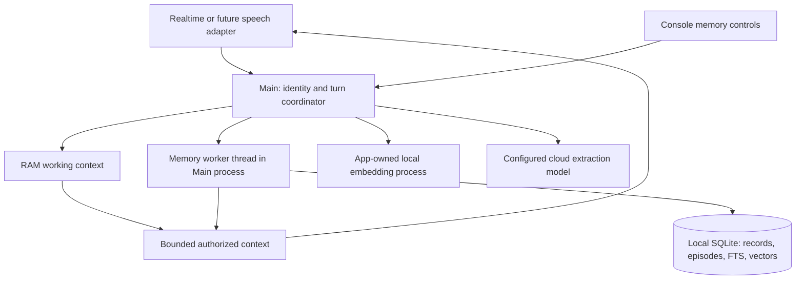

# Magic Mirror conversational memory architecture

Date: 4 October 2026. Status: **design, not implemented**. Prerequisites: [research](conversational-memory-research-2026-10-04.md) and [self-review](conversational-memory-self-review-2026-10-04.md). The user explicitly requested research, architectural design and self-review before building. This document does not enable automatic collection or change the running app.

**5 October review amendment:** the [production-architecture comparison](conversational-memory-production-review-2026-10-05.md) conditionally approves this direction and specifies six required design amendments. Read it as an addendum before implementation; this original specification alone is not the final build contract.

## 1. Product contract

Raven should remember useful things from ordinary conversation, maintain continuity within and between conversations, recognize paraphrases, bring up relevant prior experiences naturally, change its understanding when corrected, and respect forgetting. Explicit remember remains a stronger instruction, not the prerequisite for learning.

Few avatars and a small known user population allow one local memory service and database. They do not justify dropping automatic learning, vector retrieval, episodic memory or evaluation of natural conversation.

The target is this behavior, not an assertion that we know ChatGPT's internal implementation or have achieved its quality. Raw audio/transcript archiving, model training, a new speech backend, biometric authentication and a graph database are not prerequisites.

## 2. Memory layers and ownership

| Layer | Contents and lifecycle | How it is used |
| --- | --- | --- |
| Persona | Operator-authored identity, style and application rules; versioned configuration | Stable context. Automatic learning cannot rewrite tools, permissions or core persona. |
| Short-term working memory | Recent user turns, confirmed heard assistant output, current topic, referents, unresolved questions and a rolling summary; RAM | Maintains continuity and supports query formulation. A summary never substitutes for recent exact turns when they fit. |
| Core long-term memory | A compact view of stable preferences, important facts, current goals and the avatar/person relationship | Loaded after identity confirmation, available even when the new query has little lexical overlap. Derived from authoritative records, not an independent editable copy. |
| Long-term semantic memory | Individually editable facts, preferences, commitments and relationships with source and validity metadata | Retrieved by meaning and exact terms. New facts can supersede old facts without erasing the historical distinction. |
| Long-term episodic memory | Detailed, topic-sized records of meaningful interactions, events, decisions and outcomes; multiple episodes can belong to a session | Supports “what happened last time?” and questions needing several linked details. Stored and embedded, not reduced to a single generic session sentence. |

Raw conversation stays in RAM. The persistence exception expands to automatically selected structured facts, bounded episode records, summaries derived from these records, embeddings and necessary provenance. This revision is required during implementation; the old explicit-only invariant must not silently remain the advertised policy.

Episodes preserve useful details and provenance without retaining a complete verbatim archive. Accordingly, exact reconstruction of every past utterance is not promised. This is a deliberate privacy/recall tradeoff that evaluation must expose, not hide.

Private memory defaults to an avatar/person scope. An avatar's relationship with a person and private experiences stay in that scope. Operator-authored public avatar knowledge is separate. Sharing selected personal facts between avatars requires an explicit scope grant; having few avatars does not itself grant sharing.

Known people receive stable internal IDs with editable names/aliases. Main resolves human-readable labels; stable private IDs never enter renderer/model payloads. Equal names must not silently merge people. Existing avatar/name pairs migrate without automatic cross-avatar identity merging. Face matching, if later integrated, still only proposes a candidate for verbal confirmation.

## 3. Components and deployment

- Keep TypeScript/Electron and the existing React Console. Main remains the authority for identity, consent, credentials and lifecycle.
- Move memory database/search work into a worker thread within the Main process. That preserves the Main boundary for private IDs while keeping scans, indexing and disk work off the event loop. The worker is a storage executor, not another agent.
- Use SQLite as the only source of truth, FTS5 for lexical candidates and sqlite-vec for vector distance/search. Start with scoped exact search over ordinary vector columns; avoid a second durability system. Load only a bundled, pinned extension from an application-owned path, then disable further extension loading.
- Use one warm local embedding process. Preferred integration baseline: official Qwen3-Embedding-0.6B GGUF with llama.cpp/Metal. Harrier 270M is the main comparison candidate before final pinning. Do not install both as permanent production services.
- If using llama-server, bind only to loopback with a per-launch authentication secret, a private secret file/descriptor and no prompt logging. Only Main calls it; it receives text and request IDs, never private person IDs or the OpenAI master key. A fixed unauthenticated local port is not acceptable.
- Main owns this child's bounded startup/recovery and shutdown. It never owns an alternative Electron restart loop; the existing LaunchAgent remains the sole app restart owner.
- Main makes background Responses requests using the configured frozen extractor snapshot. Local embeddings do not require moving extraction to a local generative model. That separate choice would need quality/cost measurements.
- Version the embedding artifact, hash, dimensions, quantization, pooling, normalization and instruction template. No silent replacement or automatic download of a moving model alias.

## 4. Read path: memory available before the answer

The current automatic-response behavior must change for memory-enabled, confirmed-user conversation. A lookup that completes after the avatar has started answering cannot reliably inform that answer.

1. At speech start, Main freezes avatar, confirmed owner, consent and deletion epoch. Bind the eventual transcript item ID to that turn; never choose an owner from the name in a model request or a late transcript.
2. Keep VAD and the existing single microphone owner. The adapter controls response creation and explicitly preserves barge-in/cancellation. It must cover automatic VAD responses, greetings, scene speech and SDK tool continuations without creating duplicate responses.
3. Receive the final transcript for that turn. Build a retrieval query from that text plus a small amount of recent context for pronouns and implicit references. Do not call an additional LLM simply to rewrite every query.
4. Retrieve authorized active facts and episodes using local embeddings and FTS in parallel. Apply owner, avatar, sharing and validity filters before candidates can enter context. Use reciprocal-rank fusion, then prefer nonduplicated evidence and relevant current facts; recency alone cannot override relevance.
5. Add core memory, the rolling summary and selected excerpts under the memory budget. Treat excerpts as untrusted reference data, never as system instructions. Supply an actual bounded conversation item/context surface supported by the installed SDK and provider; do not log its contents.
6. Recheck owner, session, generation, turn, policy and deletion epoch. Create exactly one response for that turn. Cancel all pending results on barge-in, person change, sleep or media handoff as appropriate.

The existing recall tool remains useful for a second focused lookup when the first bundle is insufficient. It is no longer the only path that lets the avatar remember. Historical queries may retrieve superseded facts with their time bounds; normal personalization uses only currently valid records.

**5 October retrieval clarification:** semantic retrieval is the primary path for ordinary conversation. Vector search runs directly over the authorized scope, never over a keyword-filtered subset. A zero-hit lexical query cannot veto a semantic candidate. Keyword retrieval supplements exact names, titles, identifiers and dates; it is not required evidence of relevance. Use the original utterance plus a bounded context-resolved query where useful, preserving uncertainty instead of inventing entities. Core preferences and recent context remain available without any search match.

The current store already applies word segmentation and Han character bigrams before FTS5; its remaining limitation is lexical matching, not simply absent Chinese tokenization. Preserve original text and explicit aliases. Rank the union of semantic and lexical candidates, and tune lexical contribution on held-out Chinese/English cases rather than assume equal weighting is optimal. A local reranker is a candidate if relevance mistakes remain; assess its quality and speech latency before adopting it. Fusion itself is not a relevance check. Compare lexical-only, vector-only and combined retrieval, including paraphrases with no meaningful word overlap, Traditional/Simplified Chinese, exact titles, ambiguous pronouns and unrelated queries. Retain the lexical contribution only where it improves this evaluation. [Fusion and weighting reference](https://learn.microsoft.com/en-us/azure/search/hybrid-search-ranking), [multilingual embedding candidate](https://huggingface.co/Qwen/Qwen3-Embedding-0.6B).

**Deadline policy:** retrieval has a short budget. If transcription or memory is late, proceed once with still-valid core/working context, emit a metadata-only degradation reason, and never splice a stale lookup into an answer already underway. The avatar must not invent a past event when retrieval is unavailable. A later explicit memory question can perform a fresh lookup.

This preserves conversation during failure while accepting a measured latency/recall tradeoff. Proposed initial targets are in section 10; they are not measured performance.

Use one response coordinator for ordinary answers and tool continuations. Tool outputs are committed as background results; the coordinator resumes generation only after the appropriate tool batch completes and the turn is still current. Sleep/media keep their application-owned completion behavior. The versioned catalog, SDK bindings and inspector must change together. Merely disabling VAD auto-response while leaving automatic SDK tool continuations untouched would leave a second response owner.

Treat technical cloud-session rollover separately from a person change. For the same still-active, verbally confirmed conversation owner, Main may carry its authorized working summary and memory bundle into a clean replacement session. Sleep or a person change ends that ownership continuity: no old private summary enters the new confirmation session. Never use provider session IDs alone as the lifetime of the logical conversation.

## 5. Write path: automatic learning without delaying conversation

1. Collect completed ordinary turns in a bounded RAM buffer. Pair user statements with only the assistant output actually delivered; interrupted/unheard output is not evidence that the user agreed or that an action occurred.
2. Freeze owner, consent, source turn IDs and extractor-model snapshot when queuing. Identity, naming, switching, group, sleep, exact-spell and memory-control turns are excluded from general extraction. Background media speech is excluded as today.
3. Run one background extraction/consolidation job at a time per active owner. Start by coalescing up to three completed ordinary turns or 20 seconds, with a flush on topic/session boundaries. Explicit remember/correct commits promptly instead of waiting for that batch. These are initial tuning choices.
4. Give the extractor the new bounded evidence and relevant existing records. Request structured candidate operations: add fact, revise fact, add/update episode, mark a goal/commitment resolved, or no change. Refusals, truncation and invalid schemas do not become partial commits.
5. Validate in Main: source references exist; all references belong to the captured scope; content is supported; no secrets, control instructions, invented experiences or unsupported conclusions; lengths and categories are bounded. Model-reported confidence is not calibrated truth.
6. Distinguish direct statements, explicit confirmations and inferences. Automatically retain useful direct statements and grounded episode details. Do not promote a tentative inference or an unclear consequential detail into a firm core fact; keep it tentative or ask naturally when needed.
7. Compare for duplicates and contradictions. A canonical subject/predicate plus validity/source data identifies a changing fact; vector similarity only proposes matches. A changed preference supersedes its predecessor. An additional event does not overwrite another event merely because they are similar.
8. Commit records, provenance and lexical index changes atomically. Embedding jobs use record revision checks. Until a current embedding is ready, the new fact remains available through lexical/core memory; never use the old vector for revised text.
9. Rebuild only the affected core view and episode summaries. Avoid repeatedly summarizing summaries without checking their record dependencies. Background consolidation is incremental, not an all-history model call after each sentence.

A queued job may finish for its captured old owner after a conversation ends, provided consent/epoch/source eligibility still hold; its result cannot be injected into the new owner's session. Revocation or forgetting cancels it. A normal owner switch must not silently reassign or indiscriminately lose a valid pending write.

If playback cannot establish the heard portion of an interrupted assistant turn, exclude that assistant turn as evidence. A generated transcript alone never proves delivery. Persist action outcomes only from application acknowledgements, not from an avatar's spoken promise.

Automatic saving is eventually consistent. A crash can lose the most recent unprocessed RAM batch because raw transcripts are not journaled. Console must distinguish pending learning from saved records, and explicit “remembered” acknowledgement follows a commit. Restart resumes embedding/consolidation of already committed records, not reconstruction of lost raw speech.

## 6. Minimal data model

All private tables live in the same owner-only database, outside config, git, public media folders, prompt inspection and diagnostic backups.

| Entity | Required metadata |
| --- | --- |
| People and aliases | Internal stable person ID, unique operator label, aliases, consent mode and policy epoch |
| Memory records | Record ID, owner and avatar scope, kind, text, subject/predicate where applicable, epistemic status, importance, revision, recorded/event/validity times, active/superseded status |
| Episode/source records | Episode ID, scope, bounded selected content, session/turn provenance, event time and completeness; no raw audio |
| Record dependencies | Source/derived record IDs, relationship kind; supports correction and deletion of derived summaries |
| Embeddings | Record ID and revision, embedding-version ID, vector bytes; dimensions enforced; deleted with their record |
| Job state and deletion epochs | Work IDs, source IDs, revision/epoch and status; no diagnostic copy of private text |

Use relational references for provenance and lightweight relationships. No graph server is needed for this schema. Durable indexes and profiles are derived from records and can be rebuilt. Each query is scoped in storage, not filtered in the renderer after a global search.

No inherited 2,000-record lifetime ceiling. Use bounded query results, paginated Console access and disk usage visibility. Consolidate redundancies; do not silently discard meaningful long-term memories at an arbitrary count.

## 7. Correction, forgetting and isolation

Correction updates the authoritative fact, invalidates its vector/core projections, and labels any historical predecessor with its ended validity. Newer does not always mean truer: ambiguous contradictions require resolution. Distinguish an event's date from the time the app learned about it.

Forgetting is a coordinated operation:

1. Resolve the requested memory or topic in its authorized scope. Clarify a genuinely ambiguous broad deletion rather than deleting unrelated records.
2. Advance that scope's deletion epoch before mutation; old extraction/index jobs cannot commit afterward.
3. Delete the selected records, vector/FTS data and dependent copies. Remove or regenerate contaminated episode fragments and summaries using provenance. Cancel pending raw buffers that could reintroduce the deleted material.
4. Invalidate caches and rebuild a clean voice context. If clean replacement fails, stop the old conversation; never retain a speakable session with deleted context while claiming forgetting succeeded.
5. Acknowledge only after the durable operation and conversational cleanup are confirmed. Retain only content-free deletion metadata.

“Delete this memory” erases existing retained material; “never remember this category” is a separate retention policy. Do not preserve the forgotten fact itself as a semantic tombstone. Reintroduction from a new future statement requires the then-current policy; explicit re-remember can override an intentional category block with user direction.

The database is local, but extraction and retrieved context reach the configured cloud provider. Owner-only file permissions do not equal encryption. OS backups, snapshots and provider retention are not erased by deleting a row. Migration/backup and export must keep private data outside diagnostics; any future backup feature must explain this boundary.

## 8. Persona portability and avatar individuality

Keep imported character instructions in reviewed Persona configuration. Import selected personal memories as records with import provenance; mark their source and confirmation status. Do not claim that OpenAI OAuth transfers ChatGPT's hidden persona or memory database.

Each avatar can accumulate its own relationship and episode history without rewriting its designed character. Behavioral preferences learned from a person are reference facts for that relationship. Tool permissions, exact spell matching and hardware authority always remain application-controlled.

The memory service exposes transport-independent begin-turn, retrieve-context, observe-completed-turn, commit-explicit-memory, forget and close-session operations. Realtime and a future local speech pipeline use the same ownership/deletion semantics and database.

## 9. Console UX

Keep the existing Memories tab and replace topic-form-first presentation with:

- A person selector and one mode: **Automatic / Only when asked / Off**. Automatic is the intended normal experience for enrolled, consented users; guests remain ephemeral. Off disables private reads and new learning; Temporary conversation does the same for one session.
- Two simple views: **About you** and **Shared experiences**. Search understands meaning. Cards show the memory, relevant date and Edit/Forget; technical provenance stays behind a detail disclosure.
- Optional **Keep in mind** for an important memory and an explicit sharing control for selected facts across avatars.
- Clear **Learning / Up to date / Temporarily unavailable** state, plus a visible saved/forgotten result. No database, vector-dimension, model-pooling or similarity knobs in routine use.

Person selection, consent and edit/delete apply through Main. Editing during a conversation coordinates context refresh/reset and preserves unsaved operator text; it must not leave stale cloud context. Advanced diagnostics show counts, latency, queue depth and reasons only.

## 10. Budgets and performance plan

These are proposed engineering targets, not official model limits or measured results:

| Boundary | Initial target |
| --- | --- |
| Core memory + working summary + retrieved excerpts | About 3,000 tokens combined, dynamically reduced as other context grows |
| Core / summary / retrieved allocation | Approximately 600 / 600 / 1,800 tokens; whole records only |
| Recent conversation | Bounded independently, then fitted with the above inside the actual accepted provider budget |
| Hybrid retrieval candidates | Up to 20 vector + 20 lexical, fused/diversified into budgeted excerpts |
| Warm embedding plus retrieval | p95 ≤250 ms for typical short queries at 10,000 records in an active scope |
| Added speech-start delay attributable to memory | p95 ≤500 ms against the same no-memory voice baseline; ASR waiting measured separately |
| Per-turn retrieval timeout | Initial 750 ms after a usable transcript, followed by one fallback response; separate bounded ASR timeout required |
| Database/search work on Main event loop | None beyond bounded message validation and authorization |
| Background processing | One queued extraction batch per owner; one embedding runtime, query priority over indexing |

Measure exact/conservative tokenizer budgeting according to the actual model support; byte counts are not token counts. Record per-response usage and cache/latency metadata without text. The existing 16,000-token setting must pass live provider acceptance and must include all post-instruction items, not just recent dialogue. It is not a cap on total input.

Benchmark cold and warm inference, Chinese/English/code-switched text, 1k/10k/100k records, and operation alongside camera, wake detection and Live2D. Compare CPU and Metal where supported; GPU availability does not establish smooth coexistence with rendering. Cost reporting separates cloud extraction calls/tokens from Realtime and excludes local embeddings from API cost.

## 11. Migration and bounded implementation sequence

Building has not started. When it does, use this order:

1. Establish the synthetic memory-quality baseline and current voice timing; pin/verify one local embedding runtime and SQLite vector extension. Compare Qwen and Harrier before selecting the production artifact. Do not migrate user data during this spike.
2. Add the versioned schema, stable people, episodes, provenance, vectors and worker ownership. Migrate existing explicit records as explicit records; do not invent dates or episode history. Use transactional migration with failure rollback and synthetic replay tests. Do not leave an unmanaged full-data migration backup that can resurrect forgotten records. A downgrade encountering a newer schema must fail visibly, never silently load an old private copy. Never copy user data into repository artifacts.
3. Build the working-context and automatic learning pipeline with extraction validation and consistency/deletion tests. Memories remain editable and reviewable in Console; forgetting intentionally removes retained content.
4. Add bounded pre-response retrieval and summary carryover to the current Realtime adapter. Preserve wake/media dormancy, greeting/farewell ordering, exact spell matching and microphone ownership. Never send an unverified person's prior context during rollover.
5. Finish Console controls, import/review entry point and content-free health reporting. Run actual cloud/voice acceptance and packaging/restart checks before enabling automatic mode in deployment.

The migration cannot honestly be called complete after a vector lookup test. All five parts are needed for the requested user experience; they are implementation slices, not separate approval gates or reductions in the final scope.

## 12. Acceptance contract

Use synthetic, multilingual multi-session conversations with known facts and expected decisions. Keep a development set separate from a frozen holdout. Include at least 100 holdout cases spanning natural implicit use, paraphrase/cross-language recall, episodic details, changed facts, time, negation, fiction, multi-user isolation and forgetting. Store no real operator conversations in tests or reports.

Proposed release criteria:

- Zero observed cross-person/cross-avatar leakage, pre-confirmation private access or post-forget resurrection across deterministic and adversarial cases. These are strict test requirements, not a mathematical guarantee about all future inputs.
- At least 95% supported-memory precision; report recall separately so discarding everything cannot pass. At least 90% retrieval recall on answerable holdout cases and 90% grounded answer correctness on the agreed task mix. Calibrate thresholds on development data only.
- Report implicit-personalization success separately; success does not require reciting the remembered fact. Count unnecessary/repetitive reminders as errors.
- Verify “unknown” handling and refusal to invent memories. Distinguish retrieval failure from answer-generation failure and extraction loss.
- Show improvement over the current explicit/lexical implementation and a no-memory baseline. Public LongMemEval/LoCoMo samples are supplemental; their published scores are not directly comparable unless protocol/model/dataset match.
- Exercise real audio: automatic learn without “remember,” close/reopen, natural recall, correction, forgetting, interruption, delayed ASR, connection loss, expiry and looping-video wake. Confirm actual heard output, not merely generated transcript.
- Measure performance against section 10 under appliance load. Report misses and compromises; do not relabel unexecuted tests as passes.

Architecture review can finish before building. Embedding winner, latency, extraction quality and live Realtime acceptance remain empirical implementation checks.
