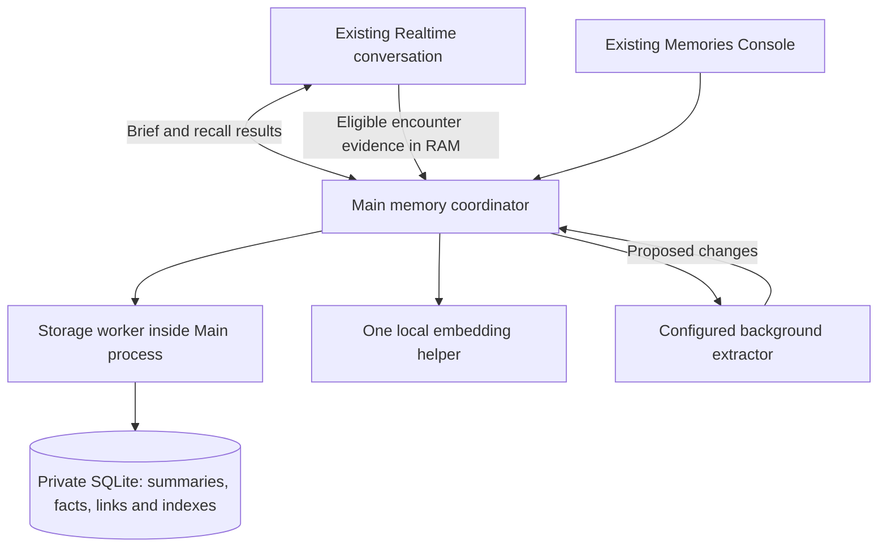

# Realtime relationship memory — architecture

Date: 2026-10-05. Status: proposed design; not implemented or runtime accepted. User direction: keep the current Realtime experience and add depth through memory. This supersedes the October 4 architecture's mandatory retrieval before every response and the earlier October 5 proposal to audition replacement speech first. Research remains available in the [options survey](avatar-conversation-memory-options-2026-10-05.md). See the accompanying [self-review](realtime-relationship-memory-self-review-2026-10-05.md).

## 1. Recommendation and product behavior

Keep Realtime as the sole speaking agent. Add an application-owned memory service with a small relationship brief, searchable topic/encounter summaries, and background consolidation. Keep recent conversation in RAM. Persist selected meaning, not conversation transcripts. Each avatar maintains a separate relationship with each confirmed returning guest.

This architecture is selected for the stated product, not claimed to be universally optimal. Local STT/TTS, GPT-Live, a second conversational agent and model changes are outside this design. Memory processing must not make ordinary replies wait for transcription, embeddings or an extractor.

Raven should recognize continuity: remember an ongoing exhibition, ask how it went at a suitable moment, retrieve an older lighting discussion when relevant, and incorporate the new outcome. It should avoid repeatedly asking about resolved matters, reciting private records, inventing familiarity, or turning a short exchange into a report. Default replies remain one conversational move, usually one or two short sentences; longer speech follows the guest's request. Memory processing is silent unless clarification or an operational result is needed.

Scope assumption: “across guests” means continuity for each returning guest. There is no implicit sharing between guests or avatars. Operator-authored public lore is separate. Multi-person attribution and cross-avatar sharing are not required to deliver this design; ambiguous/group turns remain ephemeral until a single owner is established. Confirmation is self-identification, not strong authentication.

This does not establish continuous speaker recognition: an unnoticed person speaking during a confirmed encounter can still create an attribution risk. A known group/switch signal pauses private learning and begins the clean owner-selection flow; the system must not advertise guaranteed speaker attribution from face confirmation alone.

## 2. Four kinds of context

| Context | Contents | Lifetime and loading |
| --- | --- | --- |
| Avatar persona | Operator-authored character, speaking style, public lore and application rules | Existing configuration; present throughout conversation; never rewritten by learning |
| Current encounter | Recent exchanges, current referents, unresolved questions, RAM working summary | RAM only; available to the current conversation; cleared on sleep, owner/ avatar change or restart |
| Relationship brief | Few useful current preferences, active commitments, relationship continuity and an appropriate last-encounter/open-thread cue | Derived from retained records; loaded only after owner confirmation; small and bounded |
| Memory library | Dated, self-contained episode summaries and selected durable facts/commitments | Private local storage; detailed contents supplied to Realtime only on relevant recall |

The brief is a view, not a second truth store. Each entry carries internal dependencies on authoritative records. It includes explicit importance and still-relevant ongoing matters, not an arbitrary dump of the most recently stored text. Do not promote sensitive details into unsolicited conversation merely because they are recent. Do not infer intimacy, emotions or a psychological profile from repeated interaction.

Track content-free last-surfaced metadata per retained cue and suppress repeated proactive callbacks, especially when the guest declines a topic. Mention frequency cannot increase a fact's truth or importance. Resolved/expired commitments leave the active brief. Background failure to rebuild a brief never licenses use of a stale dependency revision.

One active avatar uses one current brief and one working context. Retaining three avatar histories does not require three resident model processes. A fact known to Raven is not automatically known to another avatar.

## 3. Components

Main owns identity, permission, turn attribution, context delivery and commit validation. The storage worker serializes all database mutations and handles query work off Main's event loop. It is a worker thread inside Main's process, so private guest IDs remain within the Main boundary. The local embedding helper receives only bounded text and opaque request tokens, not private guest IDs or the cloud key. The extractor receives scoped conversation evidence and selected existing summaries, never stable guest IDs.

Use one private SQLite database as the authoritative store. Retain the existing FTS5 Chinese segmentation/bigrams. Store normalized embeddings alongside record revisions. Initial vector retrieval is an exact scoped scan in the storage worker, with bounded batches and cancellation; all authorized records are eligible, independent of keyword hits. This avoids requiring a native vector extension before its need is measured. A pinned sqlite-vec implementation can replace the scan if measured scale/latency warrants it without changing records or authorization. No approximate index, vector server, graph service or memory framework is required initially.

Use one warm local multilingual embedding runtime. Qwen3-Embedding-0.6B is the initial integration candidate, not an established quality winner. Its [publisher documents multilingual embeddings](https://huggingface.co/Qwen/Qwen3-Embedding-0.6B); the packaged model revision, runtime, quantization, pooling, dimensions and query instruction must be pinned and tested. Compare the already shortlisted smaller candidate if resource or recall results justify it. An unavailable model produces visible degraded recall, never an unannounced cloud-embedding fallback.

Use the versioned configured cloud extractor with a frozen job model snapshot. Existing Main-only key loading is unchanged. Prefer private IPC for the helper; a loopback server, if used, requires per-launch authentication, no content logging and Main-owned lifecycle. Helpers never acquire the microphone or restart Electron.

## 4. Realtime read path: remember without delaying every reply

### Entry and ordinary conversation

Before confirmation, the session receives public persona and current RAM context only. Main resolves/creates the guest identity, obtains the existing separate verbal confirmation, then prepares a bounded brief. A private brief may arrive after the confirmation acknowledgment, but must be installed at a safe response boundary without triggering another greeting. Until ready, no prior private facts are assumed available. Identity changes close the old session and confirm in a clean Persona+Master-only session.

Keep current VAD, interruption and automatic ordinary response behavior. The brief and recent conversation are enough for normal greetings, follow-ups, preferences and the current topic. There is no obligatory query, transcript wait or extra reasoning-model call per reply.

### Older or missing context

Realtime uses the versioned memory tool when a relevant historical detail is absent or uncertain. Expand the existing `memory` capability rather than introduce a second independent tool catalog. Main supplies the authorized scope; the model supplies a query, never a person ID or permission grant. A query can be semantic, an exact keyword/name, or a temporal request such as “last visit.”

1. Freeze request/session/owner generation and scope mutation epoch; resolve references against bounded current RAM context. The model-generated query can arrive before final ASR, so read-only recall does not require ASR completion. Ambiguous references are clarified, not guessed into another person's scope.
2. Search current scoped summaries/facts using independent semantic and lexical candidate paths; union and rank them. Explicit chronological queries also use dates. Preserve original names and aliases. A zero lexical score cannot veto semantic candidates.
3. Remove duplicates, invalid or stale records; apply query-specific temporal validity and relevance thresholds calibrated on held-out data. Similarity is a candidate signal, not proof. Empty results are valid. Expand only a few linked summaries when a question requires related evidence.
4. Recheck authorization, current revisions, epoch and session. Return a small result with dates, uncertainty, current/historical status and coverage: found, no match, incomplete, ambiguous or unavailable. Do not pretend a timeout proves the event never happened.
5. Let the existing SDK tool-result continuation produce the answer. The app must not also send `response.create` for the same tool. Interrupted or superseded requests return non-speaking/background completion and cannot start stale speech. Allow one focused refinement only when needed.

Use a response/turn cancellation generation as well as the session generation: a new utterance can supersede work without closing the session. Current tool bindings do not automatically make every ignored memory result non-speaking; implementation must add an explicit stale/cancelled completion contract in the shared catalog and bindings. No raw tool or provider error may enter diagnostics.

Detailed recall adds latency only to turns needing it. A brief acknowledgment can accompany a noticeable lookup; routine tool chatter is undesirable. The prompt must require evidence before a specific past-event claim. This is model behavior, not a deterministic guarantee that the model always chooses recall; evaluate missed recall and unsupported familiarity explicitly. If that fails, investigate a narrowly targeted recall gate. Do not silently restore transcript-gating of all speech.

Automatic background retrieval/prefetch is not in the initial design. It adds races and can inject unrelated details. Natural proactivity comes from the brief and unresolved threads; deeper context uses recall. This is an intentional tradeoff in favor of the already successful voice experience.

### Context delivery and lifecycle

Private context uses a dedicated bounded reference item/tool-result surface, separate from public prompt configuration and inspectors. The exact installed SDK/provider mechanism must be contract-tested to confirm insertion, replacement and acknowledgment without creating a response. `updateAgent` retains history; it is not a privacy reset. Ordinary `sendMessage` must not be used as an assumed silent context update.

All retrieved/summarized text is untrusted reference data. It cannot change tool permissions, identity, exact spell rules or retention policy, even if it contains imperative language. Extraction schemas and Main authorization remain separate from the model prompt. Exclude credentials and automatically inferred sensitive traits from learning; content filters are defense in depth, not a claim of perfect secret detection.

Track which record revisions are already in context and avoid reinjecting unchanged records. Install brief refreshes only between responses; corrections and forgetting use the stronger cleanup path below. Do not silently trim a fact mid-sentence to fit a budget. If context maintenance races new speech, keep the supported current context and defer the refresh; it cannot be required for that already-started answer.

Same-owner technical session rollover can carry a bounded working summary and fresh brief under the still-valid logical owner. Sleep, avatar/person change and restart end that continuity. They require confirmation again before loading private context. Rollover must be integrated with current playback/mic ownership and provider limits, not inferred from a timer alone.

## 5. Background learning: from exchanges to final meaning

Main captures owner, avatar, policy and logical encounter at input-turn start, before asynchronous ASR. It buffers only eligible completed evidence in RAM and binds late transcripts by item ID. Final transcript plus completed application intent classification is required before a turn becomes eligible for learning. Identity, naming, switching, group, sleep, spell and memory-control turns are excluded. Unknown attribution or missing text yields a metadata-only reason and no guessed write.

The current adapter's input-created notification is tied to commit/item creation, while speech-start is an audio event. Implementation must add an explicit speech-start owner snapshot and bind the committed item to it; ambiguous/out-of-order binding skips learning. Do not relabel the existing callback as already proving turn-start ownership.

Assistant-generated text is not evidence of a guest fact. Include only reliably delivered assistant content as dialogue context; if an interrupted heard portion cannot be established, omit that assistant contribution. Application action outcomes come from tool acknowledgments, not spoken promises. Never turn fictional roleplay, quotations or hypotheticals into biography.

Build a draft topic summary in RAM. At a meaningful topic boundary, or a bounded context-pressure/time checkpoint during long conversation, propose a distilled episode. On encounter close, consolidate unfinished topics using the remaining eligible evidence. Sleep itself is excluded, but earlier eligible turns can finish for their captured owner without delaying sleep. A normal owner switch does not reassign those jobs.

Each extraction batch marks new evidence separately from bounded context-only overlap, so a pronoun can refer to the previous topic without learning the same turn twice. Keep unprocessed eligible evidence available when compacting working context. A bounded RAM overlay of recent changes supplies immediate follow-ups and suppresses conflicting older recall; it marks pending evidence as pending, not durably saved. Explicit voice writes require the source request's finalized authorization/intent and current scope before committing. Only read-only recall can proceed without that ASR dependency.

Persist topic summaries as useful completed units rather than waiting for one fragile end-of-session call. A checkpoint can be marked unresolved and later revised; it is still a summary, never a transcript. Final consolidation settles outcomes, corrections and unresolved threads. The final encounter view can group several topic summaries rather than compress unrelated topics into one sentence. This choice limits crash loss to the uncommitted tail; a sudden exit can still lose that tail because there is no raw journal.

The extractor proposes structured records containing: topic, event/observation dates, participants as contextual labels, decision/outcome, reasons, important specifics, unresolved question, direct-statement versus inference status and references to eligible evidence. Relative dates are anchored only when unambiguous. Preserve negation, conditions and uncertainty. Inferred preferences are not automatically promoted into authoritative relationship facts.

An episode is the retained source of experience. Promote only broadly useful, supported preferences/commitments into separate fact records linked to that episode. Explicit remember records can stand alone with explicit provenance. A regenerated brief reads these current records; it does not recursively summarize the prior brief. Model schema compliance is not proof of semantic truth: conservative extraction, source checks, editable records and evaluation remain necessary.

Example: “The guest chose the museum for Saturday because rain is expected; booking is still undecided. Hiking remains a general preference.” Preserve the decision and reason together. Do not reduce it to “likes museums,” treat a proposal as a booking, or later ask how a cancelled hike went.

## 6. Consistency and minimal persistent model

| Entity | Purpose |
| --- | --- |
| People/aliases and scope policy | Stable Main-only identity; avatar/person scope, learning mode and policy epoch |
| Memory records | Episode, fact or commitment; bounded content, epistemic status, validity/event dates, revision, active/resolved/superseded status |
| Dependencies | Links from promoted facts and brief entries to retained record/claim revisions; relationship links for focused expansion |
| Search projections | FTS terms and embedding bytes tagged by record revision and embedding version |
| Operation/index metadata | Idempotency key, scope/revision checks, commit/index states; no raw transcript or payload journal |

Turn IDs locate discarded sources; they do not make original wording recoverable. Records must state that retained evidence is a distilled summary. Derived relationships are suggestions with provenance, not authority to merge people or change persona.

Every mutation—Console, explicit voice or automatic job—passes through the storage worker. An operation carries a stable ID, turn sequence, policy/owner epoch and expected record revisions. Check source as well as target revisions. Commit changes, dependencies, FTS changes and the operation marker atomically. Duplicate completion returns the prior status; it cannot reapply an old patch. Old extraction cannot overwrite a later explicit correction. Reconciliation rebuilds a proposal from current supported evidence rather than blindly retrying.

For new records as well as updates, use a scope mutation epoch so an old extraction cannot evade correction checks by inventing a new record ID. Explicit correction/forget invalidates pending dependent work and, conservatively, all older automatic proposals in that scope when dependency coverage is uncertain. Report dropped work rather than promise it was learned. Prevent renewed extraction from contaminated buffered evidence.

Indexing follows durable commit. Invalid vectors are removed atomically with record changes; late embeddings can commit only for the same live record revision. Brief/lexical recall can see a committed record before its new vector is ready; semantic coverage is then incomplete. Track pending/committed/indexed separately. “Remembered” follows a commit, never just an accepted network request.

One bounded background job runs per scope, under a global concurrency limit of one initially. Coalesce pending RAM work without silently dropping evidence. Query embeddings have priority over background indexing. When pressure exceeds the bound, expose learning failure and preserve conversation. Only committed-record indexing can resume after restart; uncommitted raw evidence cannot.

## 7. Correction, forgetting and retention

Explicit correction is stronger than older automatic learning. Update current facts and dependent briefs; preserve genuinely historical events with validity dates where appropriate. Do not keep a known extraction mistake as a historical truth. Distinguish “that used to be true” from “I never said that.”

For a fact already injected into Realtime, first suppress conflicting pending work, then commit, invalidate its derived context and safely rebuild or replace affected conversation context before acknowledging the completed correction. If reliable item-level removal cannot be proven, clean session replacement is the conservative path. Unaffected authorized working context may be carried only after sanitization; when uncertain, omit it. This exceptional operation can interrupt conversational flow and must be visible rather than hidden.

Forget is coordinated: identify the authorized target; invalidate the scope epoch and in-flight work; delete targeted records plus contaminated derivatives/indexes; purge affected RAM evidence; replace the cloud session; require clean confirmation before restoring private context. If a summary cannot be safely separated, delete the contaminated summary rather than retain a paraphrase of the forgotten fact. Do not keep value-bearing tombstones, undo history or cached tool results. Forgetting the entire person/scope follows the same rule.

If durable deletion or contextual cleanup fails, do not claim success or continue speaking from known contaminated context. Block that scope's private recall/learning until cleanup succeeds while allowing a clean public conversation. Persist a content-free cleanup-required state so a restart cannot bypass the block.

App-level forgetting means no retained app path retrieves, injects or recreates the removed content. Separately verify app-managed file cleanup: ordinary rows, FTS, vector bytes, journals and temporary files. Keep the current memory database's DELETE-journal policy initially and test it with the packaged SQLite build. [SQLite secure deletion](https://sqlite.org/pragma.html#pragma_secure_delete) and [FTS5 secure-delete](https://sqlite.org/fts5.html#the_secure_delete_configuration_option) require separate checks; a pragma alone is not proof. OS snapshots, backups, provider retention and physical SSD erasure are outside this promise. Selected cloud extraction/context still means local storage is not local-only processing.

Do not silently prune meaningful summaries at the current 2,000-record limit. Paginate Console views and monitor growth; consolidation removes redundancy without deleting its sole supporting episode. Expired commitments stop driving current personalization but can remain historical memories. “Forget this” and “never learn this category” are distinct controls; category policy does not store the forbidden fact itself.

## 8. Console and deployment

Reuse the Memories tab. Expose per-person Automatic / Only when asked / Off, a temporary conversation option, current relationship facts and encounter summaries, plus Search, Edit, Forget and Keep in mind. Off stops private reads and new learning; it does not silently erase existing records. Changing Off or temporary mode during a private session requires cleanup of already loaded context. Do not expose embedding or ranking knobs in routine UI. Preserve the existing Dormant-only Console mutation boundary initially.

Automatic learning applies only to a confirmed scope with its selected learning policy. Enabling it must make summary retention understandable to the guest; do not infer enrollment or consent from mere presence or a model's statement. A temporary/Off transition also cancels pending old-policy writes. No new automatic learning is enabled by this document.

Introduce stable identities without merging equal names. Existing avatar/name scopes become independent legacy scopes mapped to stable Main identities, with explicit records and dates preserved. A hash of a name is not a sufficient identity for two same-name guests. Ambiguity asks for disambiguation without disclosing another guest's facts. Use session-scoped opaque selectors for Console actions rather than expose private IDs. Migration is transactional; no unmanaged private backup or fallback to an old database after forgetting.

Implementation must align the explicit-only DECISIONS/tool catalog with the now-requested automatic-summary behavior in the same change. This design does not change those runtime policies. Keep all 12 invariant IDs, exact scene matching, single mic ownership, runtime model snapshots and LaunchAgent ownership. No phase promotion is implied.

## 9. Budgets, tests and delivery order

Initial tunable limits, not measured optimal settings: relationship brief about 400–600 tokens; RAM working summary up to 600; a recall result up to 1,200 including dates/uncertainty; normally 3–5 returned records. Fit them within the actual assembled persona/tools/recent-history budget, count injected items once, and evict stale memory items. Individual episode length depends on detail, not a forced one-sentence rule. Oversize topics split into linked summaries. The full media catalog must not silently consume this budget; validate total context rather than redesign media in this task.

Ordinary-turn architecture adds no mandatory awaited memory I/O. Verify actual p50/p95 speech latency against unchanged Realtime under the same load; background work can still cause contention. Start recall with a 1.5-second service deadline, return honest partial/unavailable status, and tune from the spoken trial. This is an experimental bound, not an accepted UX threshold. Time out/cancel work cleanly; no late spoken answer. Test 1k/10k/100k scoped records to learn when exact scans need replacement. No avatar-count argument substitutes for lifetime-history measurements.

Deliver in bounded slices: (1) identity/schema/consistency and synthetic migration; (2) summary learning and edit/forget lifecycle; (3) relationship brief plus semantic/lexical recall through existing Realtime tools; (4) real multi-visit voice evaluation and target-Mac packaging. A small embedding/storage probe precedes production artifact pinning. No personal data migration is needed for the probe.

Use synthetic fixtures and a held-out conversational set. Compare no-memory, existing lexical explicit memory and this design using matched persona/model. Separately score summary retention, retrieval, grounded answer, proactivity and voice experience. Include negation, fiction, changed plans, implicit follow-ups, no-word-overlap Chinese paraphrases, Traditional/Simplified Chinese, exact names, unknown queries, same-name guests, linked episodes, stale jobs and forgetting after restart. Measure missed recall-tool selection rather than assuming the model always obeys.

Proposed acceptance: zero observed unauthorized reads/writes or resurrection in deterministic/adversarial cases; at least 95% supported-memory precision, 90% recall on answerable retained records and 90% grounded answer correctness on the agreed holdout; report retention omissions and abstention separately so dropping everything cannot pass. These are design targets, not current results. Human multi-visit trials must confirm short replies, appropriate follow-ups and no meaningful regression in current voice feel. A correct search demo is insufficient.

## 10. Why this design

[Mastra's observation approach](https://mastra.ai/research/observational-memory) supports compact prepared context as an alternative to querying on every turn. [TiMem](https://arxiv.org/abs/2601.02845) supports selective access to more detailed temporal memory. We use a small brief plus a searchable library rather than loading an ever-growing observation log. Their reported benchmark scores do not establish this implementation's quality.

[OpenAI's Realtime conversation documentation](https://developers.openai.com/api/docs/guides/realtime-conversations) describes automatic turns, tool calling, manual response controls and interruption handling. Retaining the ordinary path avoids an unnecessary global transcript gate. Its [voice prompting guidance](https://developers.openai.com/api/docs/guides/voice-prompting) supports specific brevity instructions; short spoken responses do not require short or shallow internal memory.

The unresolved empirical choices are the embedding artifact, calibrated ranking/abstention thresholds, summary detail budget and reliable provider context-update contract. They must be tested, but do not require changing the four context layers or replacing Realtime. The substantive accepted tradeoffs are summary loss, possible uncommitted-tail loss, occasional recall latency and imperfect model-triggered recall. These are explicitly reviewed below rather than presented as solved.
